# Docker with Kubernetes + Swarm: Creating and Using Containers

# Table of Contents
1. [Creating and Using Containers](#Containers)
2. [Docker Commands](#Commands)
3. [Starting an Nginx Web Server](#Nginx)
    1. [Image vs Container](#ImagevsContainer)
    2. [Run/Stop/Remove Container](#RunStopContainer)
4. [What happens when we run a container?](#RunContainer)
5. [Containers vs VM](#ContainersVsVM)
[Assignment 1](#Assignment1)
6. [What's Going On In Containers](#InContainer)
7. [Getting a Shell Inside Containers](#ShellinContainer)
8. [Docker Networks: Concepts and Management](#NetworkConcepts)
    1. [Network Concepts](#NetworkConcepts)
    2. [CLI Management](#CLIManagement)
    3. [Docker Networks: Default Security](#NetworkSecurity)
    4. [Docker Network: DNS](#NetworkDNS)

## 1. Creating and Using Containers 
- Check versions of our docker cli and engine
- Create a Nginx (web server) container
- Common container management commands
- Docker Networking Basics

## 2. Docker Commands 
Syntax for docker management commands:  
NEW: `docker <management_command> <sub_command> (options)`  
OLD: `docker <command> (options)`

* `docker version`  
    This command simply returns the version of our client and the server (also called the engine) which runs in the background on our machine - called a daemon on macOS. Our docker command line is actually talking to the server on the machine and returning its values as well as the client’s values.  
    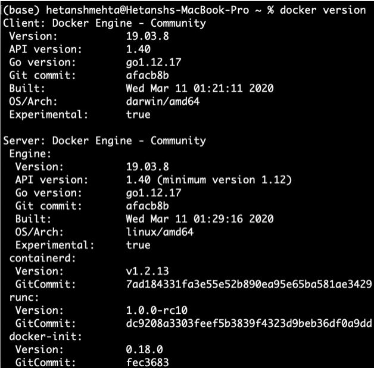

* `docker info`  
    This command returns a lot more stuff than just the version. It’ll actually give us a lot of details about our configuration and setup for our engine.  
    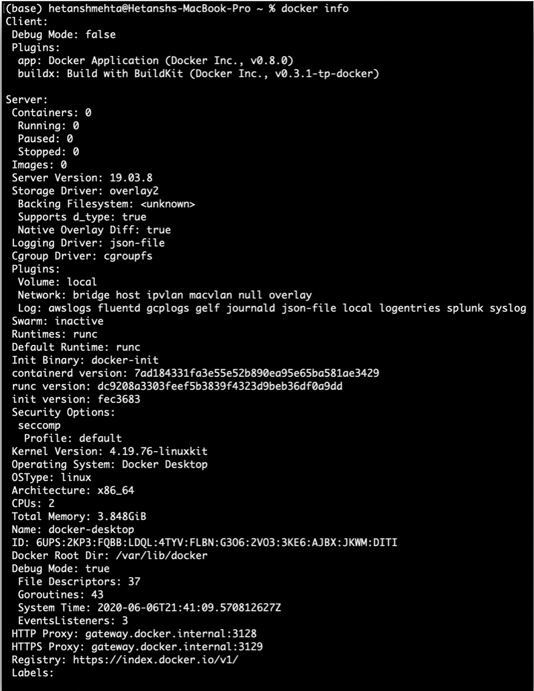

* `docker`  
    This returns a list of all the commands we can use in Docker.  
    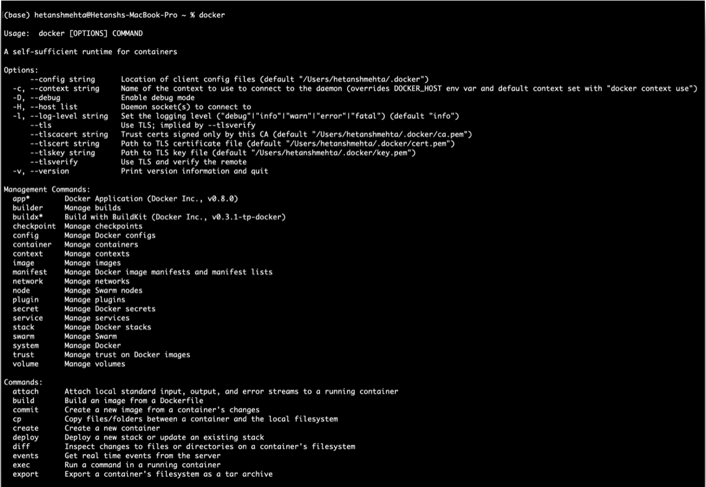

## 3. Starting an Nginx Web Server 
- Image vs. Container
- Run/Stop/Remove Containers
- Check container logs and processes

### 3.1. Image vs Container 
An **image** contains the binaries and libraries and source code that make up our application, i.e., image is the application we want to run.  
A **container** is the running instance of the image. We can have many containers based off the same image.  
We’re going to use the Open Source Nginx web server. So we’ll be starting our containers based off that Nginx image. We get all our images from registries. 
Docker’s default image registry is called [Docker Hub](https://hub.docker.com).

### 3.2. Run/Stop/Remove Container 
* `docker container run —publish 80:80 nginx`  
    - Downloads image ‘nginx’ from Docker Hub
    - Starts a new container from the image
    - Opened port 80 on the host IP (local machine) and sends all traffic from it to the executable running inside that container on the container (container IP) on port 80.
    - Since Nginx is a web server, the traffic just forwards automatically through the web browser to the localhost and into that container.
    
    Note that we’ll get a “bind” error if the left number (host port) is being used by anything else, even another container. We can use any port we want on the left, like `8080:80` or `8888:80`, then use `localhost:8888` when testing.  
    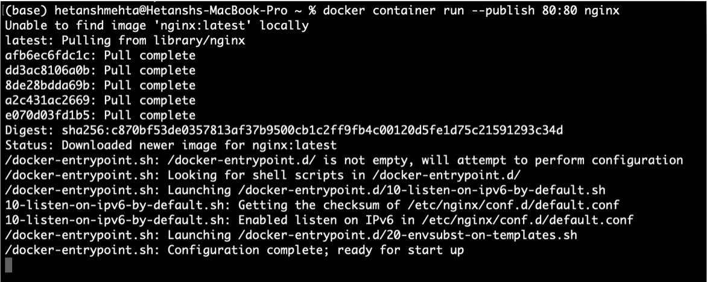

    Switch over to a web browser, and type localhost.  
    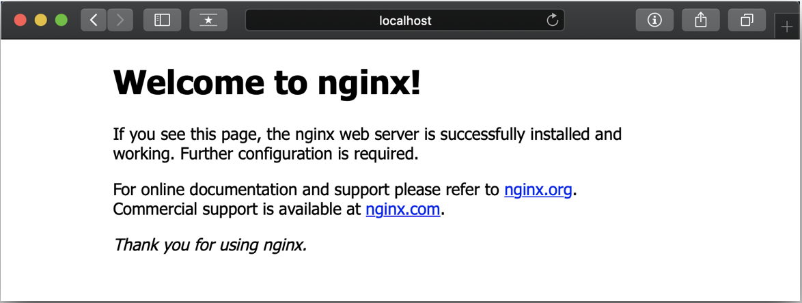

    Out Nginx Server is listening.
    We can hit refresh several times and we’ll see the log entries in our command line.  
    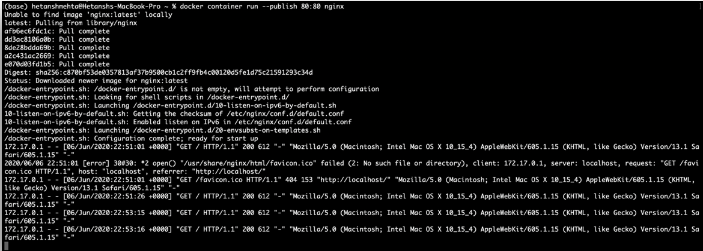  
    But we don’t always want this running in the foreground inside of our command line. 

* `docker container run —publish 80:80 —detach nginx`  
    The `--detach` tells Docker to run it in the background. And we get back the unique container ID of our container. Every time we run a new container, we get a new container ID.   
    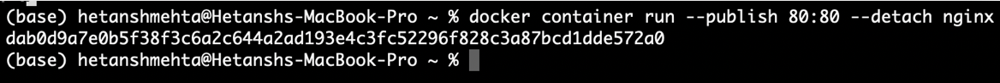

* `docker container ls`  
    Command to list all our containers. And we’ll see the one that’s still running here.  
    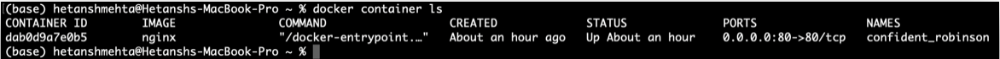

* `docker container stop <container_ID>`  
    Stops  the container matching the container id.  
    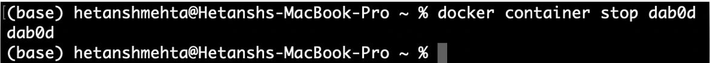

Now when we list our containers, nothing shows up as no containers are running.

* `docker container ls -a`  
    - When we ran each time the `docker container run` command, it started a new container from that Nginx image. One the right we notice that there’s these random names which we didn’t use.
    - The container IDs and the names are required to be **unique** and if we don’t specify it, then it will be created for us. 
    - We can always name something ourselves, or let it pick one on its own.  
    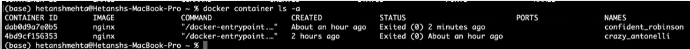

## 4. What happens when we run a container? 
When we type `docker container run`, in the background it’s actually going to look for the image that we specified at the end of the command.

When we typed nginx at the very end, that was the name of the image we wanted to run as a new container.

1. Looks for that image locally in image cache, doesn’t find anything
2. Then looks in remote image repository (defaults to Docker Hub)
3. Downloads the latest version (nginx: latest version by default) and stores it in the image cache.
4. Creates new container based on that image. It’s not going to make a copy of the image. It’s actually going to just start a new layer of changes, right on top of where that image left off.
5. It’s going to customize the networking - give it a specific virtual IP address that’s inside a Docker virtual network Gives it a virtual IP on a private network inside docker engine.
6. Opens up port we specified on host and forwards to port 80 in container. If we didn’t specify the **Publish** command, i.e., `—-publish`, it’s not going to open up any ports at all. Since we did the `80:80`, that’s telling it to take the port 80 on the host and forward all that traffic to the port 80 in the container.
7. The container finally starts by using the command (CMD) specified in the Dockerfile.

## 5. Containers vs VM 
Often people compare containers to VMs. True, there are some similarities, but there’s so many things that aren’t the same.  
But actually, containers are really just a process running on your host operating system and are nothing like a virtual machine.  
A few useful links:
https://github.com/mikegcoleman/docker101/blob/master/Docker_eBook_Jan_2017.pdf  
https://www.youtube.com/watch?v=sK5i-N34im8&feature=youtu.be&list=PLBmVKD7o3L8v7Kl_XXh3KaJl9Qw2lyuFl

## 6. What's Going On In Containers 
Start a few containers, for instance, one having an nginx image and the other having mysql image.  

* `docker container top <container_name>`  
    Process list in one container.  
    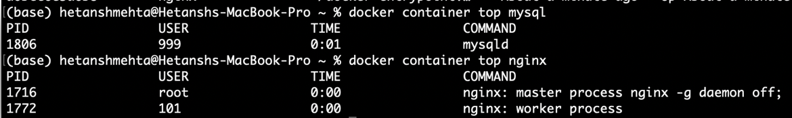 

* `docker container inspect <container_name>`  
    Details of how the container started and how it’s configured and all of its metadata (startup, config, volumes, networking, etc). Format: JSON.  
    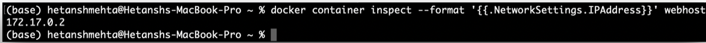

* `docker container stats`  
    Gives us a view of all our containers and the performance statistics for each in a real time stream. We get a streaming view of live performance data about our containers. Obviously in a production environment, we’re going to have a more complicated monitoring and performance.   
    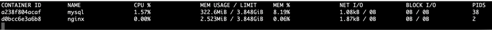

## 7. Getting a Shell Inside Containers 
This is all about getting into a container to mess around with the inside. No SSH needed, the docker cli is a great substitute for adding SSH to containers.  
* `docker container run -it <image> [COMMANDS] [ARG...]`  
    - Start a new container interactively. The `-it` is actually two separate options. The ’`t`’ actually gives us a pseudo-tty which simulates a real terminal, like what SSH does. The ‘`i`’ (interactive) allows us to keep that session open so that we can keep running more commands. When we’re doing a docker container run, we have optional command and arguments that we can send in to the new container we’re about to start to tell it what to run.   Command: `bash`  
    - If the above command is run with` -it`, it will give us a terminal inside the running container. Notice when we run the command, we act as root on the container (and not the host). The number following it is actually the container ID. We can enter the standard bash commands: `ls -al`, `pwd`, `cd`. Type `exit` to stop the container.  
    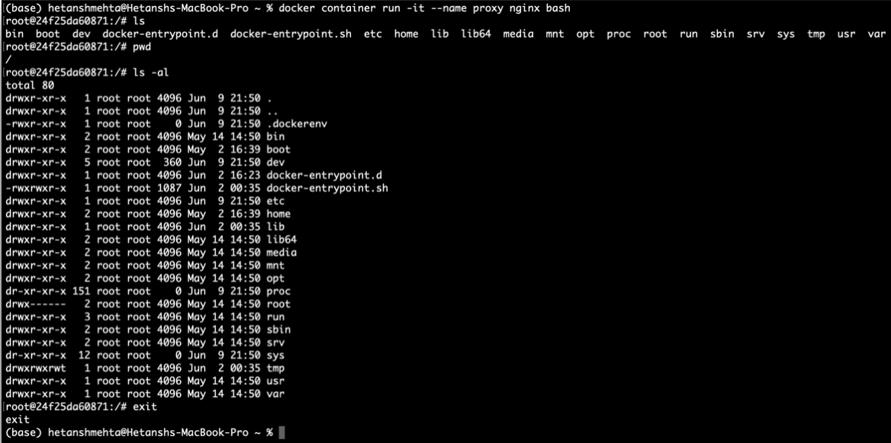 
    - Let’s see the command that it ran. The default command for an Nginx container is to run the Nginx program itself. But when we typed our last command, we changed that default program to actually be Bash, which gave us our shell. When we exited the shell, the container stopped. Because containers only run as long as the command that it ran on startup runs. Since we changed it to Bash, simply exiting Bash quit it.

Let’s set up a container with a full distribution of Linux instead of actually doing the Nginx.
* `docker container run -it --name ubuntu ubuntu`  
    - The above command is going to download the Ubuntu image and place us in the prompt of this new container. Its default CMD is bash, so we don’t have to specify it. We can use the apt package manager just like how we would in a standard Ubuntu server. We can actually install something: `apt-get install -y curl`. 
    - The thing about Ubuntu and other distributions inside a container is that they’re usually very minimal. A live CD or the ISO of Ubuntu which we would normally put on a Virtual Machine is going to have a lot more software installed by default than a Ubuntu container. We can always add more software to with the apt package manager.
    - Once we exit the shell again, it will actually stop the container. If we start it again, it would have curl installed in it. But if we create a new container from Ubuntu image, that different container wouldn’t have curl command line installed.  
    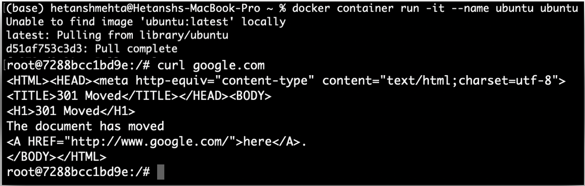 
    - You can now run linux commands: `apt-get update` and `apt-get install -y curl` are a few examples.

We can start out container again using the following command.
* `docker container start -ai <container name>`  
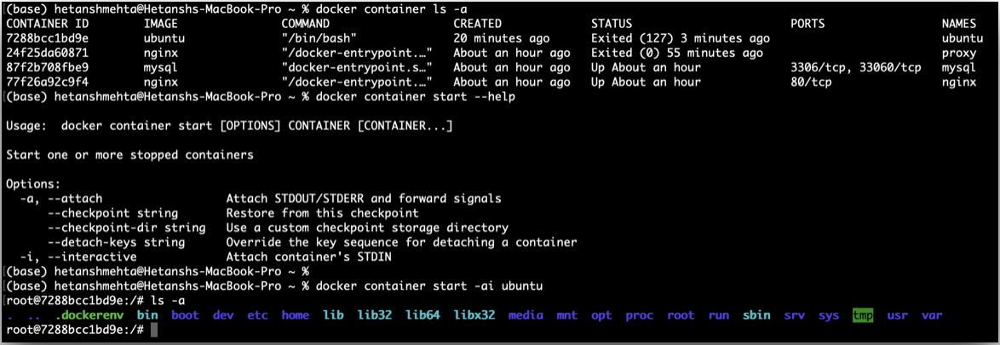

* `docker container exec [OPTIONS] CONTAINER COMMAND [ARG...]`  
    - Run additional command in existing container. This helps us run the shell inside a container that’s already running something like Nginx or MySQL.  
    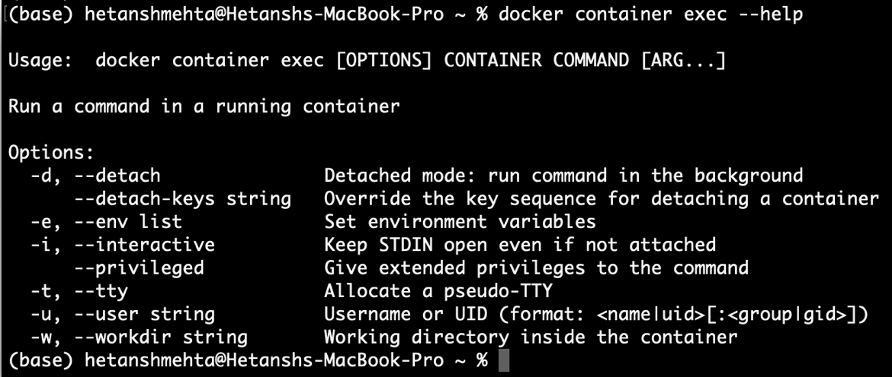
    - When we exit this bash shell, the mysql container is still running. **Because the docker container exec actually runs an additional process on an existing running container, it’s not going to affect the root process for the MySQL daemon.**
    - This is very useful for jumping into containers when we need to troubleshoot or when we need to change something slightly on a running system, as well as using containers of different distributions to give us the environment we would have if we had a full machine like Ubuntu or an Alpine.

* Different Linux Distros in containers:
    - Alpine is a small security-focused distrubution of Linux.  
    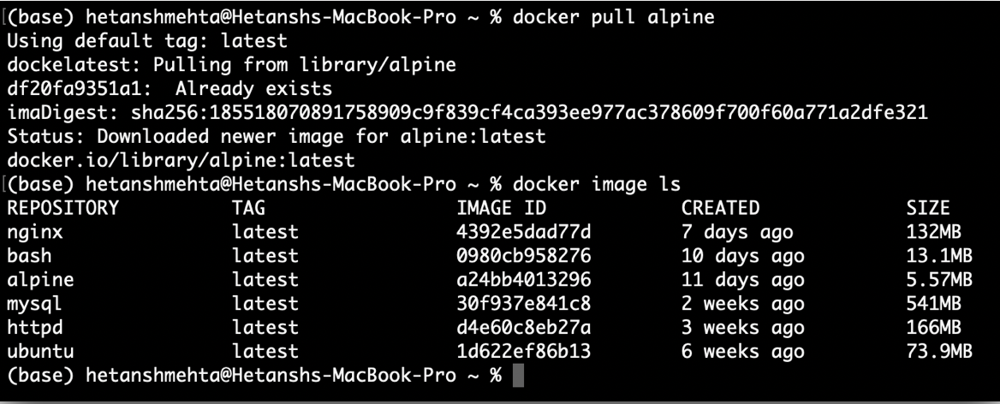
    - When we give a `bash` command in Alpine, it gives an error: 
    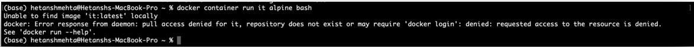
    - This is because Bash isn’t in the container. **And this goes back to the concept that we can only run things in the container that already exists in its image when we start it or maybe something we’ve added through the exec or run commands.**
    - Alpine does contain `sh` which we can make use of and install `bash` by using its package manager: `apk`. 

## 8. Docker Networks: Concepts and Management  

### 8.1. Concepts  
* `docker container run -p`  
    We’ve seen this command before. It is used to publish a container's port(s) to the host.  
    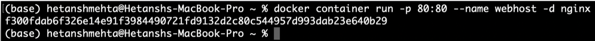

* `docker container port CONTAINER [PRIVATE_PORT[/[PROTO]]`  
    It shows which ports are forwarding traffic to that container from the host.  
    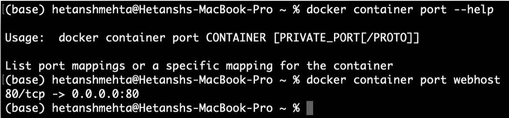

* `docker container inspect —format ‘{{.NetworkSettings.IPAddress}}’CONTAINER`  
    But we haven’t talked about the IP address of the container. So we might assume that the container is using the same IP as the host. But by default, that’s not true. We can easily get the Docker IP of that container by inspecting it.  
      

    And that’s not the IP of the Mac. So the container and the host are not on the same network.

**Default Configs:**
- When we actually start a container, we’re really in the background connecting to a particular Docker network. By default, that is the `“bridge”` network.  That is, each container is connected to a private virtual network `“bridge”`. 
- Each of those networks routs through a NAT firewall, which is actually the Docker daemon configuring the host IP address on its default interface.
- All containers on a virtual network (`“bridge”` by default) can talk to each other without -p.

**However, we can change the default configs:**
- Make new virtual networks - maybe one per app, or different ones based on different security requirements.
- Attach containers to more than one virtual network (or none).
- Skip virtual networks and use host IP (`—-net=host`).

**How things work (Refer to Network Diagram Below):**
- The host operating system is connected to a physical network. There is an Ethernet interface on the host with a firewall which blocks all incoming traffic. And any traffic coming from the containers is going to be NATed by default. 
- When we start a new container, it gets attached to a virtual network and that virtual network is automatically attached to our Ethernet Interface so that it can communicate. 
- In our case, we launched that Nginx container, we gave it a `-p 80:80`. This opens up port 80 on the Ethernet Interface on the host and forward anything coming into port 80 through the virtual network `“bridge”` to port 80 in that container. 
- By default, when we create a second container, it’s put on that same bridge network (e.g. Apache container). Those two containers can talk freely back and forth on their exposed ports.
- We can also create more virtual networks and call them whatever we want. And let’s say we connect two containers - MySQL and Node.js. The containers can communicate with the host on the specified ports. But, they are also free to talk amongst themselves over their listening ports.  

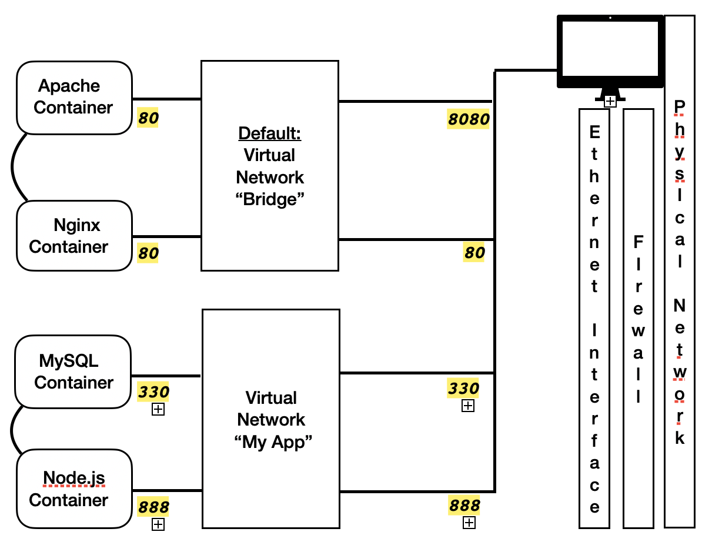  

When we think about virtual networks in Docker, and where containers belong, think about how we would put different containers in proximity to each other because they’re related in their application.

As a reminder, on the host level, we cannot have two containers listening to the same port.

### 8.2. CLI Management  
A few command line options to manage how all the virtual networking and IP stuff works.  
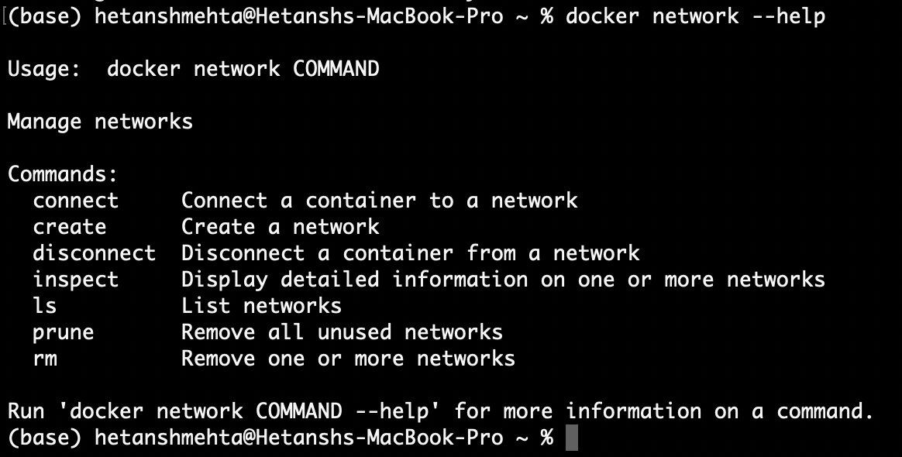  

* `docker network ls`  
    Lists all the networks. As we can create multiple networks, we surely have an ls command to list them.
    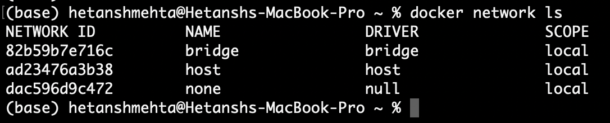  

    `—-network bridge`: is the default Docker virtual network that bridges through the NAT firewall to the physical network that the host is connected to.

    `—-network host`: It gains performance by skipping virtual networks but sacrifices security of container model.

    `—-network none`: removes eth0 and only leaves you with localhost interface in container

* `docker network inspect [OPTIONS] NETWORK [NETWORK...]`  
    Shows us the details about a specific network.

    As the default network is bridge and all our containers until now were attached to it, we can quickly run the inspect command on it. As shown below, the Nginx container is attached to the bridge network.  
    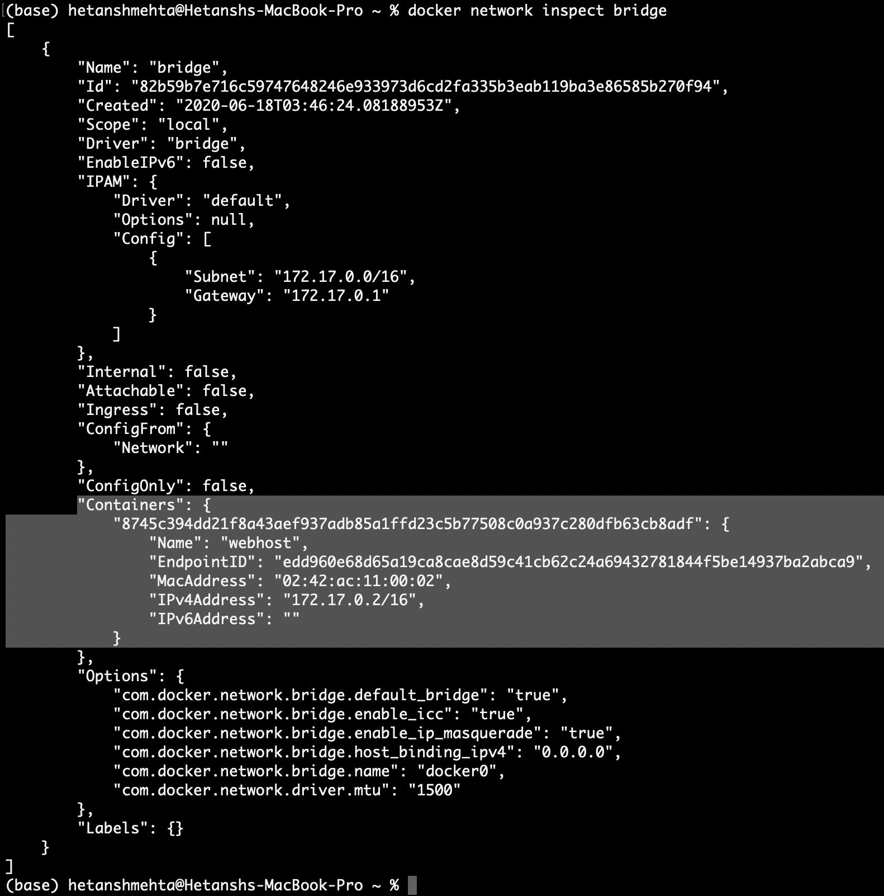

* `docker network create [OPTIONS] NETWORK`  
    Creates a new network. It has an optional driver that we can specify for using built-in and third-party drivers to create a new virtual network.  
    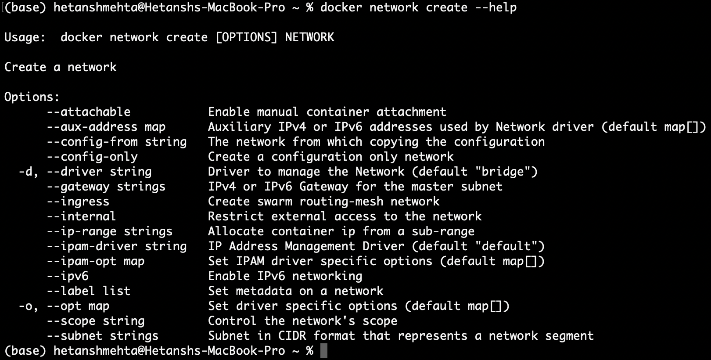  

    Let’s create a new network:  
    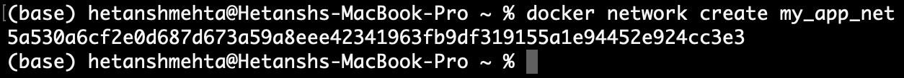 
    The new network has been created with the default bridge driver. 

We can also connect a container to a network during initialization, by specifying the network name. As an example, let’s create a new NginX container and connect it to my_app_net network created above.

* `docker container run -d —name new_nginx —network my_app_net nginx`   
    When we inspect the network my_app_net, we clearly see the newly created container connected to the network.  
    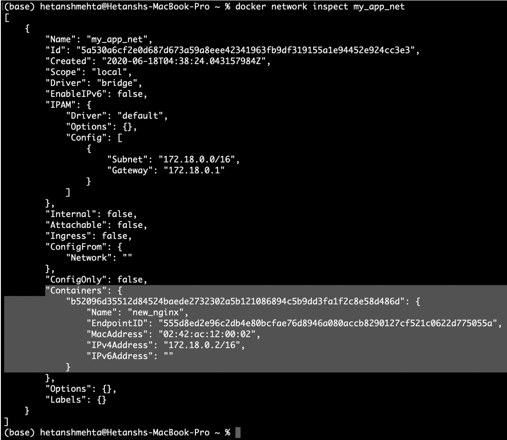  
    It also has a new IP address.

But we can also do the same with existing networks and containers.

* `docker network connect [OPTIONS] NETWORK CONTAINER` 
* `docker network disconnect [OPTIONS] NETWORK CONTAINER`  
    Connect/Disconnect commands for changing a live running container so that a new NIC is created on a virtual network for that container.

    We first pick the NETWORK and then pick the CONTAINER we want to connect/disconnect to.  
    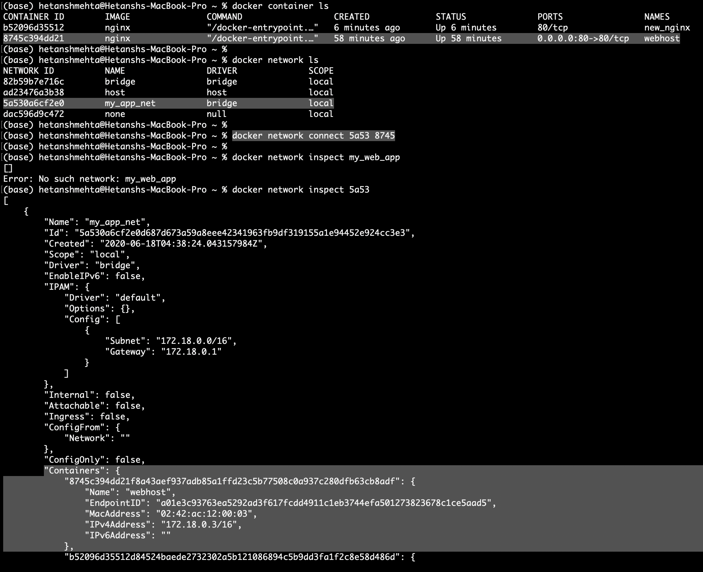  

### 8.3. Docker Networks: Default Security 
- Create your apps so frontend/backend sit on same Docker network
- Their inter-communication never leaves host
- All externally exposed ports closed by default
- You must manually expose via -p, which is better default security!

### 8.4. Docker Network: DNS 
Domain Name System (DNS) is the key to easy inter-containers comms. We can’t rely on IP addresses inside containers since they are so dynamic.  
Forget IP’s - static IP’s and using IP’s for talking to containers is an anti-pattern. Do your best to avoid it. Because containers are constantly launching, disappearing, moving and expanding, it is no longer to easily keep track of IP Addresses in order for us to use containers to communicate. The IP Addresses may not even be the same! The container might fail or go away.  
Docker provides a built-in solution for this, and that is DNS naming. **Docker uses the container names as the equivalent of a host name for containers talking to each other. Docker daemon has a built-in DNS server that containers use by default.**  

Here is the list of containers and networks:  
Container web_host is on the bridge network. Container `new_host` is on `my_app_net` network.  
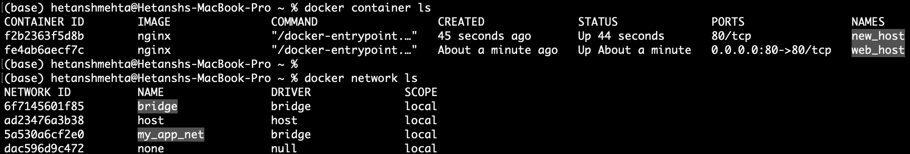  

**Because we created this new network that’s not the default bridge network, it comes with an automatic DNS resolution for all the containers on that virtual network.**  
Let’s create a second container on the virtual network, and they’ll be able to find each other with their container names regardless of what their IP address is.  
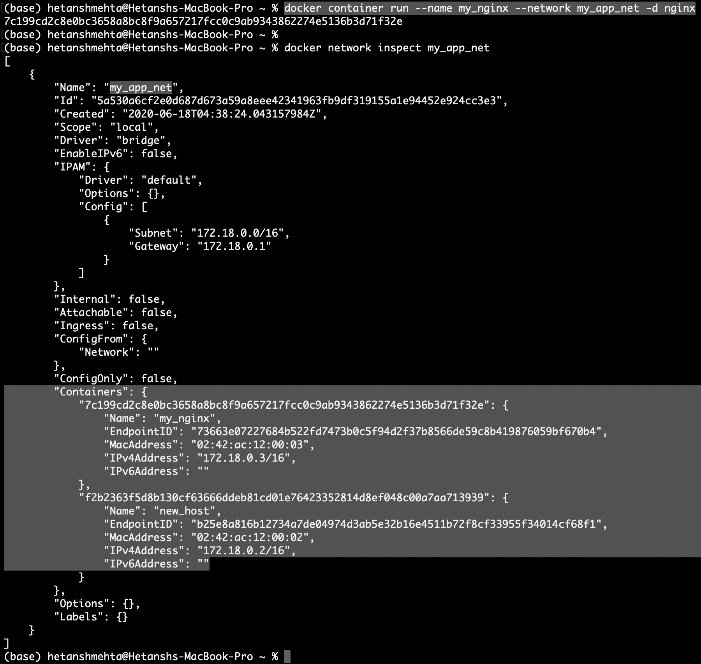  

Now we have two containers in the same virtual network. Let’s ping one container from another.  

* `docker container exec -it my_nginx ping new_host`  
    Remember, the exec command enables us to run a shell command in an already existing container. As both the containers are in the same virtual network, and the network provides DNS resolution, we can just use the container names instead of using the IP addresses.  
    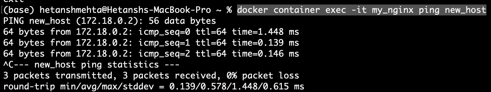  
    In a production environment where we’ve got a cluster of Docker Swarm servers, we may not know where these containers are or how long they’re going to last. Restarting the containers does not guarantee that they will spin up having the same IP addresses, but their host name or their container names, will always be the same and we can rely on them.  
    The default “bridge” network has one disadvantage here. It does not have the DNS server built into it by default. So we use the `-—link` command.
    We can specify manual links between containers in the default bridge network.

