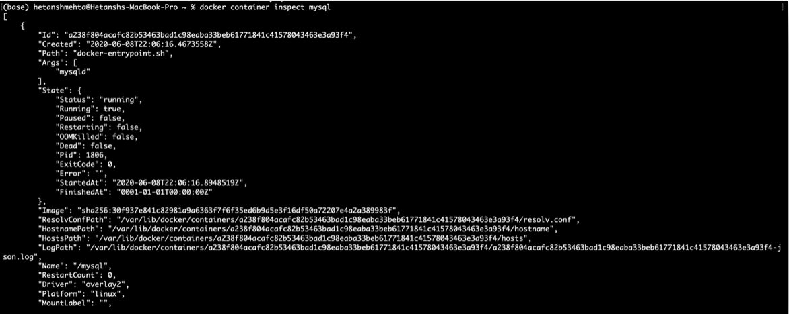

# Docker with Kubernetes + Swarm

# Table of Contents
1. [Creating and Using Containers](#Containers)
2. [Docker Commands](#Commands)
3. [Starting an Nginx Web Server](#Nginx)
    1. [Image vs Container](#ImagevsContainer)
    2. [Run/Stop/Remove Container](#RunStopContainer)
4. [What happens when we run a container?](#RunContainer)
5. [Containers vs VM](#ContainersVsVM)
[Assignment 1](#Assignment1)
6. [What's Going On In Containers](#InContainer)
7. [Getting a Shell Inside Containers](#ShellinContainer)
8. [Docker Networks: Concepts and Management](#NetworkConcepts)
    1. [Network Concepts](#NetworkConcepts)
    2. [CLI Management](#CLIManagement)

## 1. Creating and Using Containers 
- Check versions of our docker cli and engine
- Create a Nginx (web server) container
- Common container management commands
- Docker Networking Basics

## 2. Docker Commands 

Syntax for docker management commands:  
NEW: `docker <management_command> <sub_command> (options)`  
OLD: `docker <command> (options)`

* `docker version`  
    This command simply returns the version of our client and the server (also called the engine) which runs in the background on our machine - called a daemon on macOS. Our docker command line is actually talking to the server on the machine and returning its values as well as the client’s values.  
    

* `docker info`  
    This command returns a lot more stuff than just the version. It’ll actually give us a lot of details about our configuration and setup for our engine.  
    

* `docker`  
    This returns a list of all the commands we can use in Docker.  
    

## 3. Starting an Nginx Web Server 
- Image vs. Container
- Run/Stop/Remove Containers
- Check container logs and processes

### 3.1. Image vs Container 
An **image** is the binaries and libraries and source code that make up our application, i.e., image is the application we want to run.

A **container** is the running instance of the image. We can have many containers based off the same image.

We’re going to use the Open Source Nginx web server. So we’ll be starting our containers based off that Nginx image. We get all our images from registries. 
Docker’s default image registry is called [Docker Hub](https://hub.docker.com).

### 3.2. Run/Stop/Remove Container 

* `docker container run —publish 80:80 nginx`  
    - Downloads image ‘nginx’ from Docker Hub
    - Starts a new container from the image
    - Opened port 80 on the host IP (local machine) and sends all traffic from it to the executable running inside that container on the container (container IP) on port 80.
    - Since Nginx is a web server, the traffic just forwards automatically through the web browser to the localhost and into that container
    
    Note that we’ll get a “bind” error if the left number (host port) is being used by anything else, even another container. We can use any port we want on the left, like `8080:80` or `8888:80`, then use `localhost:8888` when testing.  
    

    Switch over to a web browser, and type localhost.  
    

    Out Nginx Server is listening.
    We can hit refresh several times and we’ll see the log entries in our command line.  
    

    But we don’t always want this running in the foreground inside of our command line. 

* `docker container run —publish 80:80 —detach nginx`  
    The `--detach` tells Docker to run it in the background. And we get back the unique container ID of our container. Every time we run a new container, we get a new container ID.   
    

* `docker container ls`  
    Command to list all our containers. And we’ll see the one that’s still running here.  
    

* `docker container stop <container_ID>`  
    Stops  the container matching the container id.  
    

Now when we list our containers, nothing shows up as no containers are running.

* `docker container ls -a`  
    - When we ran each time the `docker container run` command, it started a new container from that Nginx image. One the right we notice that there’s these random names which we didn’t use.
    - The container IDs and the names are required to be **unique** and if we don’t specify it, then it will be created for us. 
    - We can always name something ourselves, or let it pick one on its own.  
    

## 4. What happens when we run a container? 
When we type `docker container run`, in the background it’s actually going to look for the image that we specified at the end of the command.

When we typed nginx at the very end, that was the name of the image we wanted to run as a new container.

1. Looks for that image locally in image cache, doesn’t find anything
2. Then looks in remote image repository (defaults to Docker Hub)
3. Downloads the latest version (nginx: latest version by default) and stores it in the image cache.
4. Creates new container based on that image. It’s not going to make a copy of the image. It’s actually going to just start a new layer of changes, right on top of where that image left off.
5. It’s going to customize the networking - give it a specific virtual IP address that’s inside a Docker virtual network Gives it a virtual IP on a private network inside docker engine.
6. Opens up port we specified on host and forwards to port 80 in container. If we didn’t specify the **Publish** command, i.e., `—-publish`, it’s not going to open up any ports at all. Since we did the `80:80`, that’s telling it to take the port 80 on the host and forward all that traffic to the port 80 in the container.
7. The container finally starts by using the command (CMD) specified in the Dockerfile.

## 5. Containers vs VM 

Often people compare containers to VMs. True, there are some similarities, but there’s so many things that aren’t the same.

But actually, containers are really just a process running on your host operating system and are nothing like a virtual machine.

A few useful links:
https://github.com/mikegcoleman/docker101/blob/master/Docker_eBook_Jan_2017.pdf
https://www.youtube.com/watch?v=sK5i-N34im8&feature=youtu.be&list=PLBmVKD7o3L8v7Kl_XXh3KaJl9Qw2lyuFl

## Assignment 1 

## 6. What's Going On In Containers 

## Getting a Shell Inside Containers 

## 8. Docker Networks: Concepts and Management  
### 8.1. Concepts  

* `docker container run -p`  
    We’ve seen this command before. It is used to publish a container's port(s) to the host.  
    

* `docker container port CONTAINER [PRIVATE_PORT[/[PROTO]]`  
    It shows which ports are forwarding traffic to that container from the host.  
    

* `docker container inspect —format ‘{{.NetworkSettings.IPAddress}}’CONTAINER`  
    But we haven’t talked about the IP address of the container. So we might assume that the container is using the same IP as the host. But by default, that’s not true. We can easily get the Docker IP of that container by inspecting it.  
      

    And that’s not the IP of the Mac. So the container and the host are not on the same network.

**Default Configs:**
- When we actually start a container, we’re really in the background connecting to a particular Docker network. By default, that is the `“bridge”` network.  That is, each container is connected to a private virtual network `“bridge”`. 
- Each of those networks routs through a NAT firewall, which is actually the Docker daemon configuring the host IP address on its default interface.
- All containers on a virtual network (`“bridge”` by default) can talk to each other without -p.

**However, we can change the default configs:**
- Make new virtual networks - maybe one per app, or different ones based on different security requirements.
- Attach containers to more than one virtual network (or none).
- Skip virtual networks and use host IP (`—-net=host`).

**How things work (Refer to Network Diagram Below):**
- The host operating system is connected to a physical network. There is an Ethernet interface on the host with a firewall which blocks all incoming traffic. And any traffic coming from the containers is going to be NATed by default. 
- When we start a new container, it gets attached to a virtual network and that virtual network is automatically attached to our Ethernet Interface so that it can communicate. 
- In our case, we launched that Nginx container, we gave it a `-p 80:80`. This opens up port 80 on the Ethernet Interface on the host and forward anything coming into port 80 through the virtual network `“bridge”` to port 80 in that container. 
- By default, when we create a second container, it’s put on that same bridge network (e.g. Apache container). Those two containers can talk freely back and forth on their exposed ports.
- We can also create more virtual networks and call them whatever we want. And let’s say we connect two containers - MySQL and Node.js. The containers can communicate with the host on the specified ports. But, they are also free to talk amongst themselves over their listening ports.  

  

When we think about virtual networks in Docker, and where containers belong, think about how we would put different containers in proximity to each other because they’re related in their application.

As a reminder, on the host level, we cannot have two containers listening to the same port.

### 8.2. CLI Management  

A few command line options to manage how all the virtual networking and IP stuff works.  
  

* `docker network ls`  
    Lists all the networks. As we can create multiple networks, we surely have an ls command to list them.
      

    `—-network bridge`: is the default Docker virtual network that bridges through the NAT firewall to the physical network that the host is connected to.

    `—-network host`: It gains performance by skipping virtual networks but sacrifices security of container model.

    `—-network none`: removes eth0 and only leaves you with localhost interface in container

* `docker network inspect [OPTIONS] NETWORK [NETWORK...]`  
    Shows us the details about a specific network.

    As the default network is bridge and all our containers until now were attached to it, we can quickly run the inspect command on it. As shown below, the Nginx container is attached to the bridge network.  
    

* `docker network create [OPTIONS] NETWORK`  
    Creates a new network. It has an optional driver that we can specify for using built-in and third-party drivers to create a new virtual network.  
      

    Let’s create a new network:  
     
    The new network has been created with the default bridge driver. 

We can also connect a container to a network during initialization, by specifying the network name. As an example, let’s create a new NginX container and connect it to my_app_net network created above.

* `docker container run -d —name new_nginx —network my_app_net nginx`   
    When we inspect the network my_app_net, we clearly see the newly created container connected to the network.  
      
    It also has a new IP address.

But we can also do the same with existing networks and containers.

* `docker network connect [OPTIONS] NETWORK CONTAINER` 
* `docker network disconnect [OPTIONS] NETWORK CONTAINER`  
    Connect/Disconnect commands for changing a live running container so that a new NIC is created on a virtual network for that container.

    We first pick the NETWORK and then pick the CONTAINER we want to connect/disconnect to.  
      

### 8.3. Docker Networks: Default Security
- Create your apps so frontend/backend sit on same Docker network
- Their inter-communication never leaves host
- All externally exposed ports closed by default
- You must manually expose via -p, which is better default security!

