# Docker with Kubernetes + Swarm: Container Images: Where To Find Them and How To Build Them


# Table of Contents
1. [What’s in an Image? (And What Isn't?)](#WhatIsInImage)
2. [Images and Their Layers](#ImageLayers)
    1. [Visualizing Layers](#VisualizingLayers)
    2. [Container Layers](#ContainerLayers)
3. [Image Tagging and Upload to Docker Hub](#ImageTag)
    1. [Making New Tags](#NewTags)
    2. [Push To Docker Hub](#PushDockerHub)
4. [Building Images: The Dockerfile Basics](#DockerfileBasics)


## 1. What's in an Image? (And What Isn't) <a name="WhatIsInImage"></a>
* An image contains the binaries and the dependencies for the application and the metadata on how to run it.
* Official definition: “An image is an ordered collection of root filesystem changes and the corresponding execution parameters for use within a container runtime.”
* Inside the image, there’s not actually a complete OS. There’s no kernel, kernel modules (e.g. drivers).
* An image can be as small as one file (the app binary) like a golang static binary
* Or it could be as big as a Ubuntu distro with apt, and Apache, PHP, and more installed.


## 2. Images and Their Layers <a name="ImageLayers"></a>
It uses something called the union file system to present a series of file system changes as an actual system. <br>

Let's get a list of images on our system cache: <br>
*   `docker image ls`
    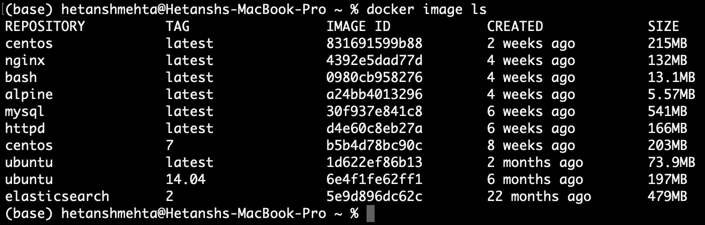

*   For the same image ID, we can have different tags. Images are however
    recognized by their IDs.

Let's do a quick docker image history on nginx:
* `docker image history [OPTIONS] IMAGE`
    *   This does not list the things that have happened in the container,
        but it actually is a history of the image layers. 
    *   Every image starts from a blank layer known as scratch. 
    *   Then every set of changes that happens after that on the file system,
        in the image, is another layer. 
    *   Some changes may involve a simple metadata change, whereas some may
        involve big data changes. <br>
        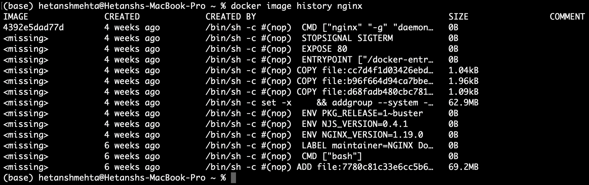

* `docker image inspect [OPTIONS] IMAGE [IMAGE...]`
    *   Display detailed information on one or more images.
    *   Returns JSON metadata about the image
    *   Besides the basic info (image ID, tags), we get all sorts of details
        around how this image expects to be run. Gives option to expose certain ports inside the image and handle environment variables. <br>
        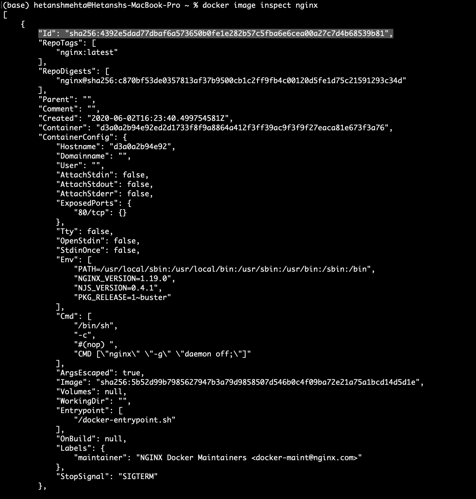

### 2.1. Visualizing Layers <a name="VisualizingLayers"></a>
*   When we start an image, i.e., when we create a new image, we're starting
    with one layer. Every layer gets its own unique SHA that helps the system identify if that layer is indeed the same as another layer.
*   All other images can access the layers from cache and build something on
    top of it - saving a lot of space and time. As the layers have a unique SHA, it's guaranteed to be the exact layer it needs to add/remove.
*   If we decide that we want to have the same image to be the base image for
    more layers, then it's only ever storing one copy of each layer.

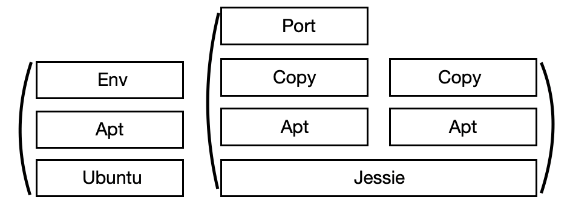

For instance, let's say we have Ubuntu at the very bottom as the first layer. <br> Then we create a Dockerfile, which adds some more files and that's another layer on top of that image (We may us `apt` for that). <br> Then we also add an environment variable change (`env`) which completes our image.

We might have a different image that starts from `debian:jessie` and then on that image we may use `apt` to install some stuff - like MySQL, we may copy some file over, open a port, etc. 

**If we have another image that's also using the same version of jessie, it can have its own changes on top of the layer that we have in our cache.**
This is where the fundamental concept of cache of images help us save a lot of time and space.


### 2.2. Container Layers <a name="ContainerLayers"></a>
*   When we run a container off of an image, all Docker does is, it creates a
    **new read/write layer** for that container on top of the image.
*   If we ran two containers at the same time off of the same image,
    container 1 and container 2 would only be showing, *the **difference** in file space between what's happened on that live container running and what's happening in the base image (which is read-only).*
*   When we use a container to change a file which is in the image, the file
    system will take that file out of the image and copy it into the differencing, and store a copy of that file in the container layer. This is known as **copy-on-write (COW)**.


## 3. Image Tagging and Upload to Docker Hub <a name="ImageTag"></a>
*   Images don't technically have a name.
*   If we do `docker image ls`, we notice that there's no name column. <br>
     
*   None of us are going to remember the image ID, we have to refer to them
    by **`<user_name OR organization>/<repository_name>:<tag>`**
*   *Official* repository images only contain the `repository_name`, and not
    the actual organization_name/repository_name
*   **Example**: <br>
    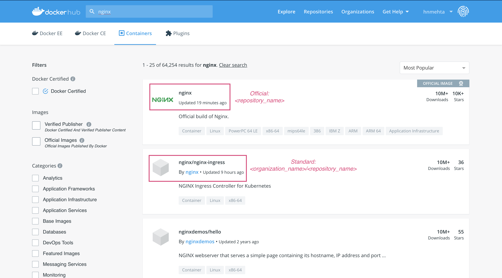
*   `docker pull organization/repository` to pull a standard docker image.
*   The tag is not quite a version and it's not quite a branch, but it is a
    lot like Git tags. It's really a pointer to a specific image commit. They are just labels that point to an actual image ID and we can have many of them all point to the same id.<br>
    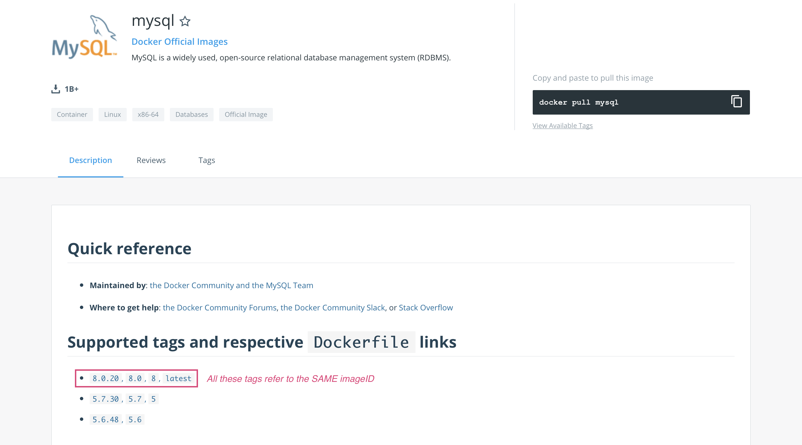
*   We already have `mysql:latest` downloaded, but from the picture above, we
    can also run `docker pull mysql:8.0.20`, it will refer to the same image from cache, as their imageID is the same. They will not be stored twice.<br>
    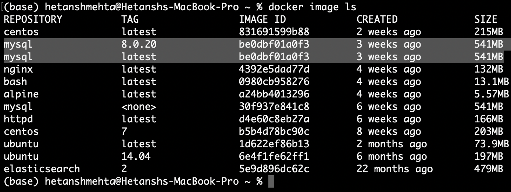

### 3.1. Making New Tags <a name="NewTags"></a>
We could make our own Dockerfile and create our own custom image, or, we can also re-tag existing Docker images.
* `docker image tag SOURCE_IMAGE[:TAG] TARGET_IMAGE[:TAG]`
    * Create a tag TARGET_IMAGE that refers to SOURCE_IMAGE
    
    * Create a new tag for nginx image. <br>
      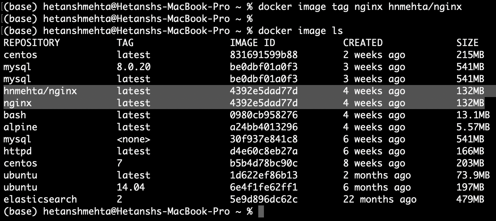

### 3.2. Push To Docker Hub <a name="PushDockerHub"></a>
*   Ensure that you are logged in to a docker registry from the command line
    using `docker login`
*   `docker image push [OPTIONS] NAME[:TAG]` <br>
    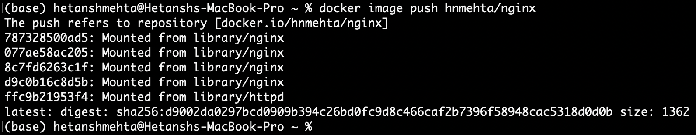 <br>
    We don't actually have to create it from scratch to upload it. We just gave a new tag to an existing image and when we uploaded it, it automatically created a new repo based on that tag. <br>
    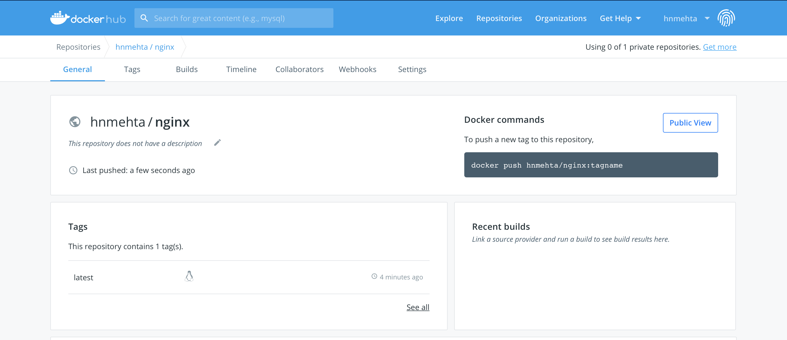
*   It defaulted to `latest` as we didn't specify a tag.
*   We can specify tags and push as shown: <br>
    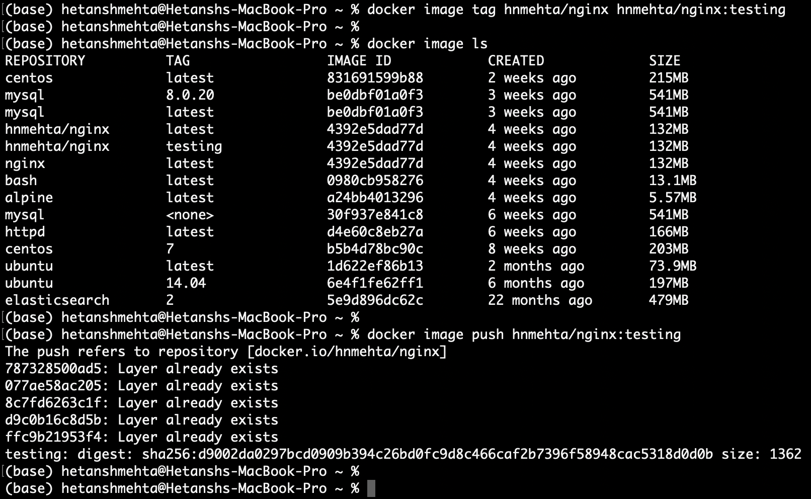 <br> Notice how it says "Layer already exists" - saving us space. It wouldn't upload again. <br>
    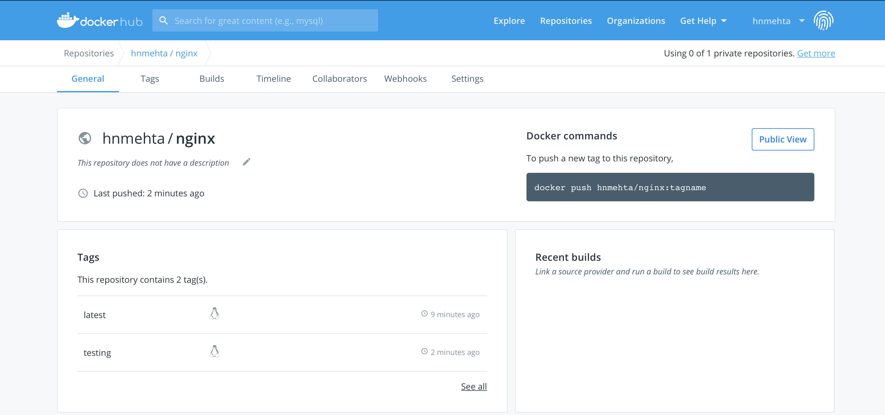 <br>


## 4. Building Images: The Dockerfile Basics <a name="DockerfileBasics"></a>
*   Docker builds images automatically by reading the instructions from a
    `Dockerfile` -- a text file that contains all commands, in order, needed to build a given image.
*   `Dockerfile` is not a batch file, not a shell script. It's a totally
    different language that is unique to Docker.
*   We use the `-f` flag with docker build to point to a `Dockerfile`
    anywhere in our file system.
    ```dockerfile
    docker build -f /path/to/a/Docerfile .
    ```

*   A Docker image consists of read-only layers each of which represents a
    Dockerfile instruction. The layers are stacked and each one is a delta of the changes from the previous layer. Consider this `Dockerfile`: <br>
    ```dockerfile
        FROM ubuntu:18.04
        COPY . /app
        RUN make /app
        CMD python /app/app.py
    ```
*   Each instruction creates one layer:
    - `FROM` creates a layer from the `ubuntu:18.04` Docker image.
    - `COPY` adds files from your Docker client's current directory.
    - `RUN` builds your application with `make`.
    - `CMD` specifies what command to run within the container.

*   When we run an image and generate a container, we add a new writable
    **layer** (the “container layer”) on top of the underlying layers. All changes made to the running container, such as writing new files, modifying existing files, and deleting files, are written to this thin writable container layer.

* Consider this [Dockerfile](./Dockerfile-Samples/dockerfile-sample-1/Dockerfile) which is broken down into several components/(**layers**) below:

    *   First up is the `FROM` command. The `FROM` command is in every
        Dockerfile. It's normally a minimal distribution. One of the main benefits for using them (distributions) in containers is to use their package distribution systems (e.g. `apt`, `yum`) to install whatever software we need.
    *   All of these distributions are official images, it means that
        they're always up to date with the latest security patches.
    *   ```dockerfile
        # all images must have a FROM
        # usually from a minimal Linux distribution like debian or (even better) alpine
        # if you truly want to start with an empty container, use FROM scratch
        FROM debian:stretch-slim
        ```

    *   Next, we have the `ENV` stanza, and ENV is for environment
        variables. The `ENV` instruction sets the environment variable `<key>` to the value `<value>`. 
    *   The environment variables set using `ENV` will persist when a
        container is run from the resulting image.
    *   ```dockerfile
        ENV <key> <value>
        ENV <key> <value> ...
        ```
        ```dockerfile
        # optional environment variable that is used in later lines and set as envvar when container is running
        # Setting the versions to install:
        ENV NGINX_VERSION 1.13.6-1~stretch
        ENV NJS_VERSION   1.13.6.0.1.14-1~stretch
        ```

    *   The `RUN` command is really just executing shell commands inside
        the container as it's building it.
        It has two forms:
        *   `RUN <command>` (shell form, the command is run in a shell, which by default is /bin/sh -c on Linux or cmd /S /C on Windows)
        *   `RUN ["executable", "param1", "param2"]` (exec form)
    *   The reason for adding the double ampersand `&&` is so that
        they're chained one after the other. It ensures that all of the commands are fit into one single layer.
    *   `RUN` can also be used to point the log files to `stdout` and
        `etderr`. The proper way to do logging inside a container is to not log to a log file. Docker actually handles the logging. We must however mention that everything we want to be captured is in the logs is spit to stdout and stderr.
    *   ```dockerfile
        # optional commands to run at shell inside container at build time
        # this one adds package repo for nginx from nginx.org and installs it
        RUN apt-get update \
            && apt-get install --no-install-recommends --no-install-suggests -y gnupg1 \
            && \
            NGINX_GPGKEY=573BFD6B3D8FBC641079A6ABABF5BD827BD9BF62; \
            found=''; \
            for server in \
                ha.pool.sks-keyservers.net \
                hkp://keyserver.ubuntu.com:80 \
                hkp://p80.pool.sks-keyservers.net:80 \
                pgp.mit.edu \
            ; do \
                echo "Fetching GPG key $NGINX_GPGKEY from $server"; \
                apt-key adv --keyserver "$server" --keyserver-options timeout=10 --recv-keys "$NGINX_GPGKEY" && found=yes && break; \
            done; \
            test -z "$found" && echo >&2 "error: failed to fetch GPG key $NGINX_GPGKEY" && exit 1; \
            apt-get remove --purge -y gnupg1 && apt-get -y --purge autoremove && rm -rf /var/lib/apt/lists/* \
            && echo "deb http://nginx.org/packages/mainline/debian/ stretch nginx" >> /etc/apt/sources.list \
            && apt-get update \
            && apt-get install --no-install-recommends --no-install-suggests -y \
                            nginx=${NGINX_VERSION} \
                            nginx-module-xslt=${NGINX_VERSION} \
                            nginx-module-geoip=${NGINX_VERSION} \
                            nginx-module-image-filter=${NGINX_VERSION} \
                            nginx-module-njs=${NJS_VERSION} \
                            gettext-base \
            && rm -rf /var/lib/apt/lists/*

        # forward request and error logs to docker log collector
        RUN ln -sf /dev/stdout /var/log/nginx/access.log \
	        && ln -sf /dev/stderr /var/log/nginx/error.log
        ```

    *   By default, no TCP or UDP ports are open **inside** a container.
        It doesn't expose anything from the container to a virtual network unless we list it here.
    *   `EXPOSE` command does not mean these ports are going to be opened
        automatically on our host. That's what the `-p` command is for whenever we use `docker run`
    *   ```dockerfile
        # expose these ports on the docker virtual network
        # you still need to use -p or -P to open/forward these ports on host
        EXPOSE 80 443
        ```
    
    *   The `CMD` instruction has three forms:
        *   `CMD ["executable","param1","param2"]` (exec form, this is
            the preferred form)
        *   `CMD ["param1","param2"]` (as default parameters to
            ENTRYPOINT)
        *   `CMD command param1 param2` (shell form)
    *   There can only be **one** `CMD` instruction in a Dockerfile. If
        you list more than one `CMD` then only the last `CMD` will take effect.
    *   The main purpose of a `CMD` is to provide defaults for an
        executing container. These defaults can include an executable, or they can omit the executable, in which case you must specify an `ENTRYPOINT` instruction as well.
    *   ```dockerfile
        # required: run this command when container is launched
        # only one CMD allowed, so if there are multiple, last one wins
        CMD ["nginx", "-g", "daemon off;"]
        ```
        
    *   The order of these layers matter.

