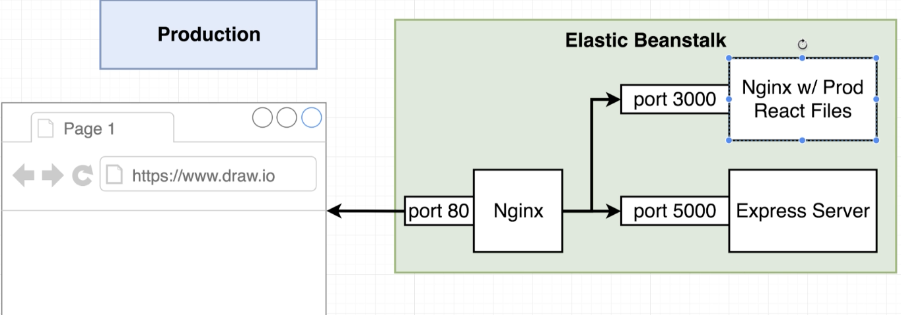
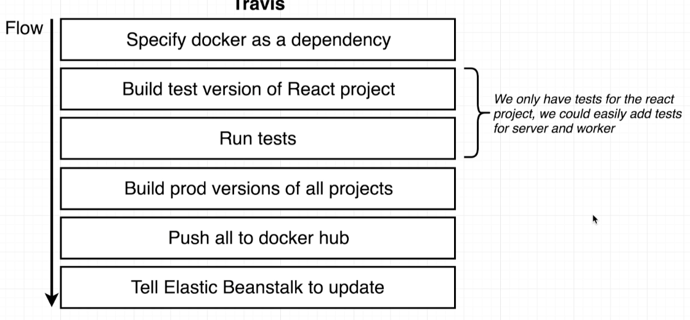

# Docker and Kubernetes: The Complete Guide
## Continuous Integration Workflow with Multiple Images

## Table of Contents:
1. [Workflow Overview](#WorkflowOverview)
2. [Production Dockerfiles](#ProductionDockerfile)
3. [Travis CI Setup](#TravisCISetup)


## Workflow Overview <a name="WorkflowOverview"></a>

In general, the worflow is going to be similar to a single image. Although instead of building the production image on Elastic Beanstalk, this time we will push the built image to Docker Hub from where Elastic Beanstalk can pull the built image and deploy. So everything is going to be done by Travis and that also once.
Here is the workflow in steps:


## Production Dockerfiles <a name="ProductionDockerfile"></a>
- Like mentioned earlier, Travis CI build the images and push them to Docker Hub, so that Elastic Beanstalk does not have to build the image.
- Just like earlier, we keep development and production docker files separate. Production Dockerfile is called **Dockerfile** and Development Dockerfile **Dockerfile.dev**
- The production Dockerfiles for Server, Nginx and Worker are going to be same as the development files and the only difference would be the way Server and Worker servers start. From package.json, we see that `npm run start` is used for production and `nodemon` for development.
- Now, we have 1 nginx server for routing between frontend and backend servers already. But we need another nginx server that serves the production built files just like the previous project. Something like this:

- It is a good design to keep 2 separate nginx servers for assessing the static react files and the other for routing requests to Express and React servers.
- Alternatively, we now listen to the new nginx server on port 3000 (react server).

## Travis CI Setup <a name="TravisCISetup"></a>

- To create a link between Github and TravisCI, we need to enable TravisCI to build the repository.
- The next step is to create a **.travis.yml** file inside the repository. Steps would look something like this:

- The travis.yml file looks something like this:
```
language: generic
sudo: required
services:
  - docker

before_install:
  - docker build -t harshn12/react-test -f ./client/Dockerfile.dev ./client

script:
  - docker run -e CI=true harshn12/react-test npm test -- --coverage

after_success:
  - docker build -t harshn12/multi-client ./client
  - docker build -t harshn12/multi-nginx ./nginx
  - docker build -t harshn12/multi-server ./server
  - docker build -t harshn12/multi-worker ./worker
  # Log in to docker CLI
  - echo "$DOCKER_PASSWORD" | docker login -u "$DOCKER_ID" --password-stdin
  # Take those images and push them to docker hub
  - docker push harshn12/multi-client
  - docker push harshn12/multi-nginx
  - docker push harshn12/multi-server
  - docker push harshn12/multi-worker
```
- Note: DOCKER_ID and DOCKER_PASSWORD are environment variables created on TravisCI.
- `before_install` basically runs tests when the code is pulled from github to TravisCI.
- We then login to docker hub account and push the built images.
