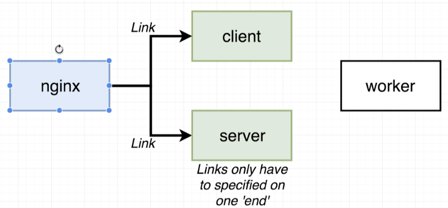

# Docker and Kubernetes: The Complete Guide
## Multi-Container Deployment to AWS

## Table of Contents:
1. [Multi-Container Definition Files](#MultiContainerFiles)
2. [Docs on Container Definitions](#DocsContainerDefinitions)
3. [Adding Container Definitions to DockerRun](#ContainerDefinitionsDockerRun)


## Multi-Container Definition Files <a name="MultiContainerFiles"></a>
- We saw for a single Dockerfile app, we did not have to setup any configuration on Elastic BeanStalk to build an image and run the image, it was automatic.
- But for this section, we are dealing with multiple docker files and hence setup is required because Elastic BeanStalk does not know which Dockerfile to run.
- So, we create a file in our project directory called **Dockerrun.aws.json** which will tell EBS where to pull all of our images from, what resources to allocate to each one, port mappings and some associated information.
- Note: **Docker-compose is primarily meant for development environment**
- **Dockerrun.aws.json** is very similar to defining a docker-compose file. Rather than referring to each Dockerfile as a service, we call them container definition. The biggest difference is that docker-compose specifies how to build an image using dockerfile. But in the case of **Dockerrun.aws.json**, we already have built images pulled from Docker Hub.
- So we will configure it to fetch images from Docker hub and use it for each of the container definitions.

## Docs on Container Definitions <a name="DocsContainerDefinitions"></a>

- ElasticBeanStalk doesn't really know how to work with multiple containers.
- ElasticBeanStalk delegates the hosting off to Elastic Container Service(ECS) which is another AWS service.
- We create task definitions which are essentially instructions on how to run one single container.
-  The container definitions which we define in **Dockerrun.aws.json** can be found here https://docs.aws.amazon.com/AmazonECS/latest/developerguide/task_definition_parameters.html#container_definitions

## Adding Container Definitions to DockerRun <a name="ContainerDefinitionsDockerRun"></a>

- **Dockerrun.aws.json**
```{
  "AWSEBDockerrunVersion": 2,
  "containerDefinitions": [
    {
      "name": "client",
      "image": "harshn12/multi-client",
      "hostname": "client"
    }
  ]
}
```
- Each element in the array corresponding to containerDefinitions is going to create one distinctly separate container inside of our application.
- `name` field is the name of the container that will show up on the dashboard
- `image` pulls the specified image from Docker Hub.
- `hostname` is similar to how services are named in docker-compose file, so that other services can access this service. E.g. we could access client container in default.config simply by using the hostname.
- The `essential` flag is to tell if the container is to be marked essential. If we mark a container as `essential` and the container crashes at some point, then all the other containers in the group will be closed down at the same time.
- The only service that is essential in our case is the **Nginx** routing server as it routes to the client and the express api servers. If this server goes down, the other servers cannot access any other service.
- **Note: Atleast 1 of the service in the contianer definitions must be marked as essential.**
- We do not add hostname to nginx container as no other service needs to directly access nginx(its optional).
- The additional flag is `portMappings` which maps the port from local machine to the container. This is similar to `ports: -3050:80` in docker-compose file.
- One last flag we add is `links`, which allows explicit mapping of the services. In docker-compose, this was done by simply calling the service name. In ECS, we need to form distinct links between the containers.

- Links are **unidirectional** and so client and server does not need to have reverse links. The name to links we provide maps to the name given to the container definition.
<!--  -->
