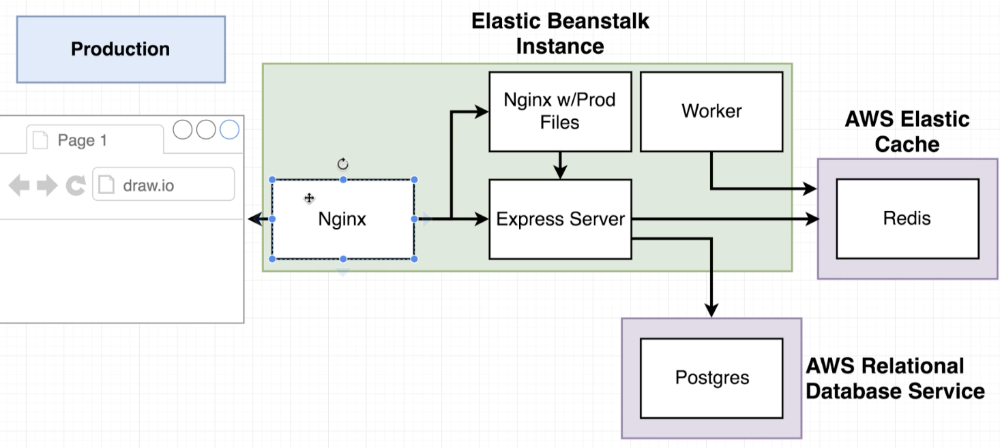
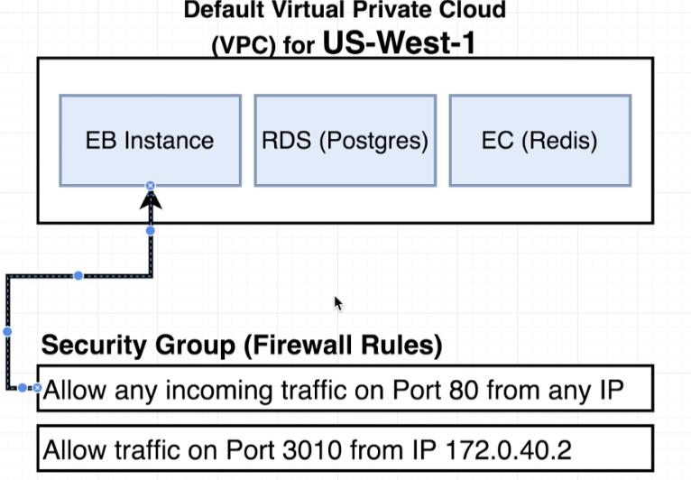

# Docker and Kubernetes: The Complete Guide
## Multi-Container Deployment to AWS

## Table of Contents:
1. [Multi-Container Definition Files](#MultiContainerFiles)
2. [Docs on Container Definitions](#DocsContainerDefinitions)
3. [Adding Container Definitions to DockerRun](#ContainerDefinitionsDockerRun)
4. [Creating Elastic BeanStalk Environment](#BeanStalkEnvironment)
5. [Data Service Providers](#DataServiceProviders)
6. [Overview of AWS VPC's and Security Groups](#awsVPCSecurityGroups)
7. [RDS and Cache Creation](#RDSCacheCreation)
8. [Travis Deploy Script](#TravisDeployScript)


## Multi-Container Definition Files <a name="MultiContainerFiles"></a>
- We saw for a single Dockerfile app, we did not have to setup any configuration on Elastic BeanStalk to build an image and run the image, it was automatic.
- But for this section, we are dealing with multiple docker files and hence setup is required because Elastic BeanStalk does not know which Dockerfile to run.
- So, we create a file in our project directory called **Dockerrun.aws.json** which will tell EBS where to pull all of our images from, what resources to allocate to each one, port mappings and some associated information.
- Note: **Docker-compose is primarily meant for development environment**
- **Dockerrun.aws.json** is very similar to defining a docker-compose file. Rather than referring to each Dockerfile as a service, we call them container definition. The biggest difference is that docker-compose specifies how to build an image using dockerfile. But in the case of **Dockerrun.aws.json**, we already have built images pulled from Docker Hub.
- So we will configure it to fetch images from Docker hub and use it for each of the container definitions.

## Docs on Container Definitions <a name="DocsContainerDefinitions"></a>

- ElasticBeanStalk doesn't really know how to work with multiple containers.
- ElasticBeanStalk delegates the hosting off to Elastic Container Service(ECS) which is another AWS service.
- We create task definitions which are essentially instructions on how to run one single container.
-  The container definitions which we define in **Dockerrun.aws.json** can be found here https://docs.aws.amazon.com/AmazonECS/latest/developerguide/task_definition_parameters.html#container_definitions

## Adding Container Definitions to DockerRun <a name="ContainerDefinitionsDockerRun"></a>

- **Dockerrun.aws.json**
```{
  "AWSEBDockerrunVersion": 2,
  "containerDefinitions": [
    {
      "name": "client",
      "image": "harshn12/multi-client",
      "hostname": "client",
      "essential": false
    },
    {
      "name": "server",
      "image": "harshn12/multi-server",
      "hostname": "api",
      "essential": false
    },
    {
      "name": "worker",
      "image": "harshn12/multi-worker",
      "hostname": "worker",
      "essential": false
    },
    {
      "name": "nginx",
      "image": "harshn12/multi-nginx",
      "hostname": "nginx",
      "essential": true,
      "portMappings": [
        {
          "hostPort": 80,
          "containerPort": 80
        }
      ],
      "links": ["client", "server"]
    }
  ]
}
```
- Each element in the array corresponding to containerDefinitions is going to create one distinctly separate container inside of our application.
- `name` field is the name of the container that will show up on the dashboard
- `image` pulls the specified image from Docker Hub.
- `hostname` is similar to how services are named in docker-compose file, so that other services can access this service. E.g. we could access client container in default.config simply by using the hostname.
- The `essential` flag is to tell if the container is to be marked essential. If we mark a container as `essential` and the container crashes at some point, then all the other containers in the group will be closed down at the same time.
- The `memory` flag is the amount of memory allocated for that container.
- The only service that is essential in our case is the **Nginx** routing server as it routes to the client and the express api servers. If this server goes down, the other servers cannot access any other service.
- **Note: Atleast 1 of the service in the container definitions must be marked as essential.**
- We do not add hostname to nginx container as no other service needs to directly access nginx(its optional).
- The additional flag is `portMappings` which maps the port from local machine to the container. This is similar to `ports: -3050:80` in docker-compose file.
- One last flag we add is `links`, which allows explicit mapping of the services. In docker-compose, this was done by simply calling the service name. In ECS, we need to form distinct links between the containers.

- Links are **unidirectional** and so client and server does not need to have reverse links. The name to links we provide maps to the name given to the container definition.

## BeanStalk Environment <a name="BeanStalkEnvironment"></a>
- Elastic BeanStalk allows 2 types of environments, web server and worker environment.
    - Web Server environment are for standalone web application that respond to HTTP requests, mostly on port 80.
    - Woker environment processes long-running workloads.

## Data Service Providers <a name="DataServiceProviders"></a>
- In the development environment, we had the redis and the postgres running inside the containers. But as we move to a production environment, we change the architecture.
- Here is the production architecture:
 
- The Nginx servers, Express and worker servers will all be running in the Elastic BeanStalk instance which are wired up in the Dockerrunaws json file.
- However, the postgres and redis servers will not be inside the EB instance. Instead, we rely on 2 external services **AWS Relational Database Services(RDS)** and **AWS Elastic Cache**.
- The above 2 data services are not customized specifically for EBS and can be used in general with any other services.
- Reasons to use the above services:
    - It automatically creates and maintains Redis and postgres instances for you. All the configurations are setup by default which is really helpful.
    - It is extremely easy to scale at any time.
    - There is built in logging and maintenance if there are security patches around Redis and postgres.
    - Much better security than we do.
    - Very easy to migrate off of EB with some other services. E.g. if the cost is too high and we want to switch to another redis or postgres providing service.
    - It is completely decoupled from Elastic BeanStalk.
    - AWS allows automated backups and rollbacks of postgres databases.
- **Stephen Grider: As a Software Engineer your time is worth money, so using these services makes lives easier as we don't have to recreate existing softwares.**

## Overview of AWS VPC's and Security Groups <a name="awsVPCSecurityGroups"></a>
- Inside the Elastic BeanStalk instance, we have 4 different containers and we will use the external aws services postgres and redis to connect to some of the containers inside EBS instance.
- By default these services cannot talk to each other as it requires us to setup a distinct link.
- These links are setup completely by clicks on the AWS User Interface.
- When we create the EBS instance, it's created in a specific region. Each of these regions by default get a **Virtual Private Cloud(VPC)** created. A VPC is a network where the services used are isolated for that account.

- **Note: Each account gets only 1 VPC created per region by default.**
- To get the different services to connect and talk to each other, we have to create something called a **Security Group(Firewall Rules)**. These groups govern the incoming traffic to the services.

- By default there is a **Security Group** created when the EBS is started.
- We want to create a **Security Group** that allows any traffic from any other AWS services that has this **Security Group**.

## RDS and Cache Creation <a name="RDSCacheCreation"></a>
- Create Database username and password on AWS RDS Database service which will be the environment variables in the docker file.
- Likewise, we do the same for ElastiCache service and get the credentials.
- We create a custom Security Group that allows the EBS containers to talk to these services.
- We edit the Inbound rules of the SG by restricting the ports from 5432 to 6379 which are the postgres and redis ports. The source is set to be the same SG which will allow traffic between all the services that have the SG assigned.
- Next we go to each of the services EBS, ElastiCache and AWS RDS and assign the created SG.
- **Note: Changing Security Group does not require maintenance and can be done immediately**.
-  Now, we need to make sure the different containers know how to reach out to RDS and EC. To do so we use environment variables that we created.
-  EBS -> Configuration -> Environment properties is where the credentials are set.
-  This will automatically get added to the containers running inside the EBS instance and we do not need to assign the environment variables manually.

## Travis Deploy Script <a name="TravisDeployScript"></a>
- The Last step to deployment is updating the travis.yml file to trigger the EBS instance to pull docker images deployed to Docker Hub and run the EBS instance.
- The only difference is that the only file we have to deploy to EBS is the **Dockerrun.aws.json**.
- Set the AWS keys on TravisCI as environment variables.
- We add the following snippet to the travis.yml file for deploying to EBS:
```
deploy:
  provider: elasticbeanstalk
  region: 'us-east-1'
  app: 'multi-docker'
  env: 'MultiDocker-env'
  bucket_name: 'elasticbeanstalk-us-east-1-923445559289'
  bucket_path: 'docker-multi'
  on:
    branch: master
  access_key_id: $AWS_ACCESS_KEY
  secret_access_key: $AWS_SECRET_KEY
```
- If the deployment to EBS fails for some reason, you can check the logs on EBS under Logs for debugging.
- The most important step while using AWS services is to shut them down if they are not being used anymore as you will get billed for the services.

<!--  -->
