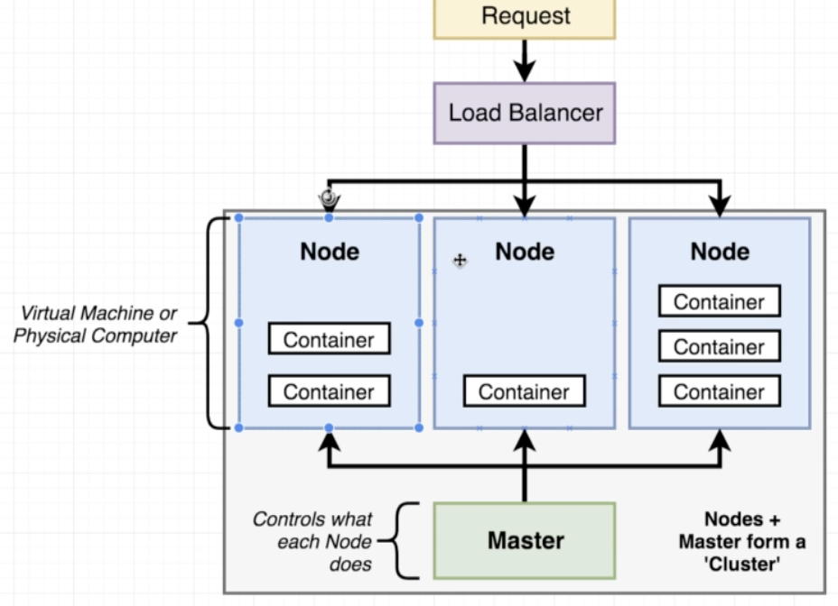
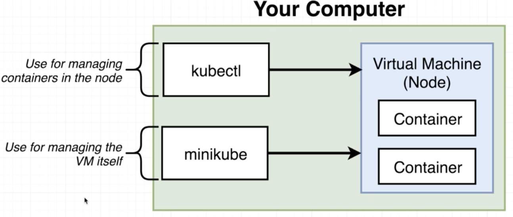
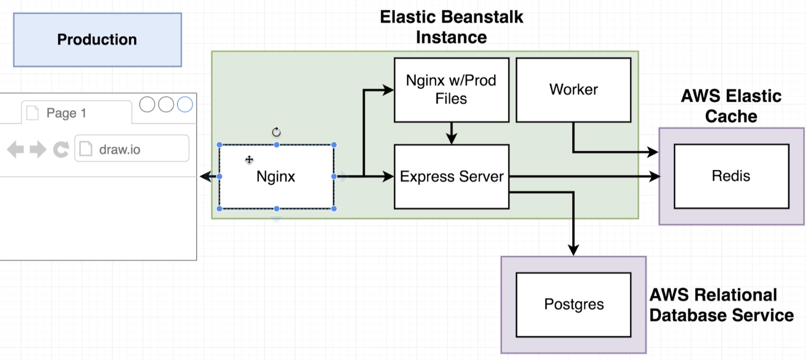
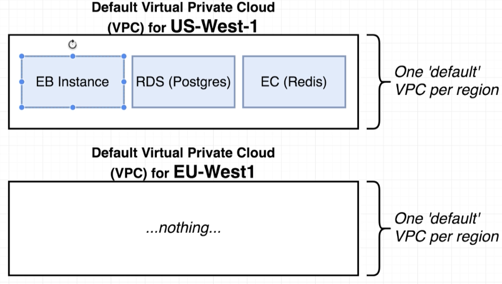
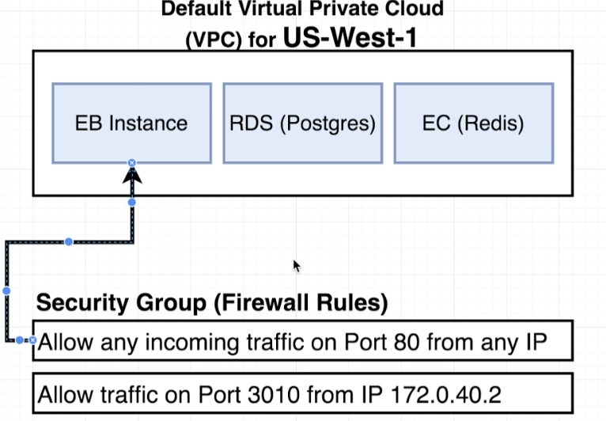
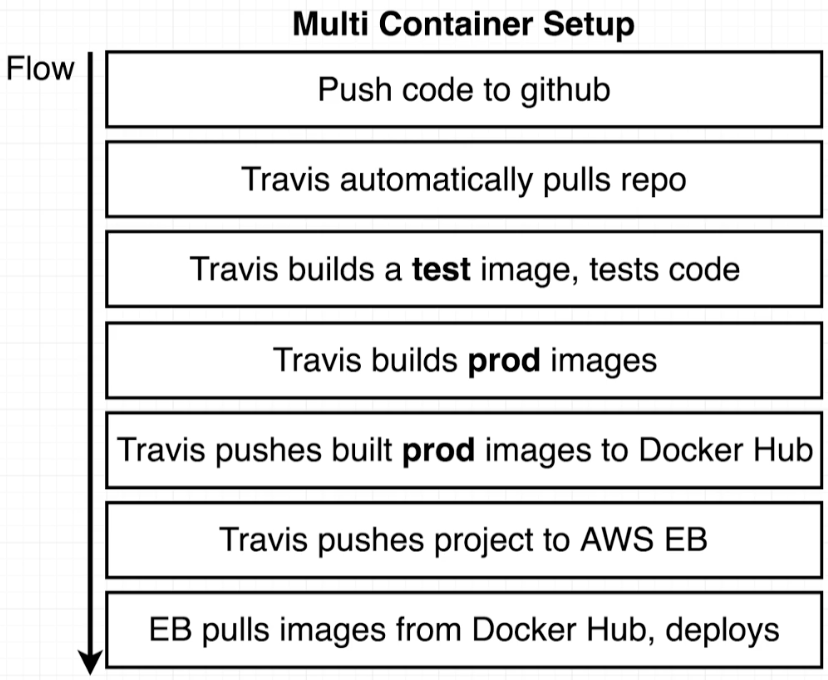

# Docker and Kubernetes: The Complete Guide
## Kubernetes Basics

## Table of Contents:
1. [Introduction to Kubernetes](#IntroKubernetes)
2. [Kubernetes in Development and Production](#KubernetesDevProd)
3. [Minikube Setup](#MinikubeSetup)
4. [Creating Elastic BeanStalk Environment](#BeanStalkEnvironment)
5. [Data Service Providers](#DataServiceProviders)
6. [Overview of AWS VPC's and Security Groups](#awsVPCSecurityGroups)
7. [RDS and Cache Creation](#RDSCacheCreation)
8. [Travis Deploy Script](#TravisDeployScript)


## Introduction to Kubernetes <a name="IntroKubernetes"></a>

- When it comes to scaling, say the previous project, we want to increase the number of Worker containers as that is the main source of computation.
- The Nginx, Server and Client containers remain the same, its the worker containers that we would increase.
- A **Cluster** in kubernetes is the assembly of master and 1 or more **Nodes**. A **Node** is a virtual machine or a physical computer that can be used to run some number of different containers.
- Below is an image of a Kubernetes Cluster:

- These **Nodes** are managed by something called **Master**. The **Master** has a set of programs running on it that control what each of the **Node** is running at a given time.
- We are responsible for writing the code on **Master**, e.g. we want 5 containers running in 1 **Node**.
- The **Load Balance** will take traffic in terms of network requests and relay them into each of those **Nodes**.
- So Kubernetes is a system for running many different containers over multiple different machines.
- Kubernetes is used when we want to run multiple different containers from different images at the same time. e.g. for Scalability.


## Kubernetes in Development and Production <a name="KubernetesDevProd"></a>

- In a development environment, we make use of kubernetes by using a program called **minikube**. **Minikube** is a comman-line tool whose sole purpose is going to be to setup a kubernetes cluster on the local computer.
- In the production environment, we make use of what are called **Managed solutions**. **Managed Solutions** are external cloud providers such as AWS and Google Cloud.
- **Minikube** is going to create a virtual machine(node) whose sole purpose is going to be to run containers.
- In order to interact with the containers inside the node, we use a program called **kubectl**. It is a program used to manage a cluster in general.

- **Minikube** is only used in local environment, however **kubectl** is used both in production and local environment to manage the containers inside a node.
- To setup a kubernetes cluster, we need to install:
    - **kubectl** - CLI for interacting with the master.
    - **VM driver virtualbox** - Used to make a virtualbox which be the single node.
    - **minikube** - runs a single node on that virtual machine.

## Minikube Setup <a name="MinikubeSetup"></a>

- Steps:
    - Install HomeBrew by running the command on https://brew.sh/, `which brew` to check it is installed successfully.
    - Install Kubectl by running `brew install kubectl`, `which kubectl` to verify the installation.
    - Install VM Driver virtualbox from https://www.virtualbox.org/
    - Install Minikube by running `brew install minikube` and again `which minkube` to verify.
    - Start minkube by running `minikube start`. This will automatically access the virualbox downloaded and setup a virtual machine and it will configure the VM to behave as a kubernetes node.
    - Run `minikube start --driver=hyperkit` to start VM with hyperkit driver instead of docker driver.
- To make sure everything is working as we expect, run the command `minikube status`. This should show that minkube is running. `kubectl cluster-info` shows information about the ip address the cluster is running on.
-

<!-- ## Data Service Providers <a name="DataServiceProviders"></a>
- In the development environment, we had the redis and the postgres running inside the containers. But as we move to a production environment, we change the architecture.
- Here is the production architecture:
 
- The Nginx servers, Express and worker servers will all be running in the Elastic BeanStalk instance which are wired up in the Dockerrunaws json file.
- However, the postgres and redis servers will not be inside the EB instance. Instead, we rely on 2 external services **AWS Relational Database Services(RDS)** and **AWS Elastic Cache**.
- The above 2 data services are not customized specifically for EBS and can be used in general with any other services.
- Reasons to use the above services:
    - It automatically creates and maintains Redis and postgres instances for you. All the configurations are setup by default which is really helpful.
    - It is extremely easy to scale at any time.
    - There is built in logging and maintenance if there are security patches around Redis and postgres.
    - Much better security than we do.
    - Very easy to migrate off of EB with some other services. E.g. if the cost is too high and we want to switch to another redis or postgres providing service.
    - It is completely decoupled from Elastic BeanStalk.
    - AWS allows automated backups and rollbacks of postgres databases.
- **Stephen Grider: As a Software Engineer your time is worth money, so using these services makes lives easier as we don't have to recreate existing softwares.**

## Overview of AWS VPC's and Security Groups <a name="awsVPCSecurityGroups"></a>
- Inside the Elastic BeanStalk instance, we have 4 different containers and we will use the external aws services postgres and redis to connect to some of the containers inside EBS instance.
- By default these services cannot talk to each other as it requires us to setup a distinct link.
- These links are setup completely by clicks on the AWS User Interface.
- When we create the EBS instance, it's created in a specific region. Each of these regions by default get a **Virtual Private Cloud(VPC)** created. A VPC is a network where the services used are isolated for that account.

- **Note: Each account gets only 1 VPC created per region by default.**
- To get the different services to connect and talk to each other, we have to create something called a **Security Group(Firewall Rules)**. These groups govern the incoming traffic to the services.

- By default there is a **Security Group** created when the EBS is started.
- We want to create a **Security Group** that allows any traffic from any other AWS services that has this **Security Group**.

## RDS and Cache Creation <a name="RDSCacheCreation"></a>
- Create Database username and password on AWS RDS Database service which will be the environment variables in the docker file.
- Likewise, we do the same for ElastiCache service and get the credentials.
- We create a custom Security Group that allows the EBS containers to talk to these services.
- We edit the Inbound rules of the SG by restricting the ports from 5432 to 6379 which are the postgres and redis ports. The source is set to be the same SG which will allow traffic between all the services that have the SG assigned.
- Next we go to each of the services EBS, ElastiCache and AWS RDS and assign the created SG.
- **Note: Changing Security Group does not require maintenance and can be done immediately**.
-  Now, we need to make sure the different containers know how to reach out to RDS and EC. To do so we use environment variables that we created.
-  EBS -> Configuration -> Environment properties is where the credentials are set.
-  This will automatically get added to the containers running inside the EBS instance and we do not need to assign the environment variables manually.

## Travis Deploy Script <a name="TravisDeployScript"></a>
- The Last step to deployment is updating the travis.yml file to trigger the EBS instance to pull docker images deployed to Docker Hub and run the EBS instance.
- The only difference is that the only file we have to deploy to EBS is the **Dockerrun.aws.json**.
- Set the AWS keys on TravisCI as environment variables.
- We add the following snippet to the travis.yml file for deploying to EBS:
```
deploy:
  provider: elasticbeanstalk
  region: 'us-east-1'
  app: 'multi-docker'
  env: 'MultiDocker-env'
  bucket_name: 'elasticbeanstalk-us-east-1-923445559289'
  bucket_path: 'docker-multi'
  on:
    branch: master
  access_key_id: $AWS_ACCESS_KEY
  secret_access_key: $AWS_SECRET_KEY
```
- If the deployment to EBS fails for some reason, you can check the logs on EBS under Logs for debugging.
- The most important step while using AWS services is to shut them down if they are not being used anymore as you will get billed for the services. -->

<!--  -->
