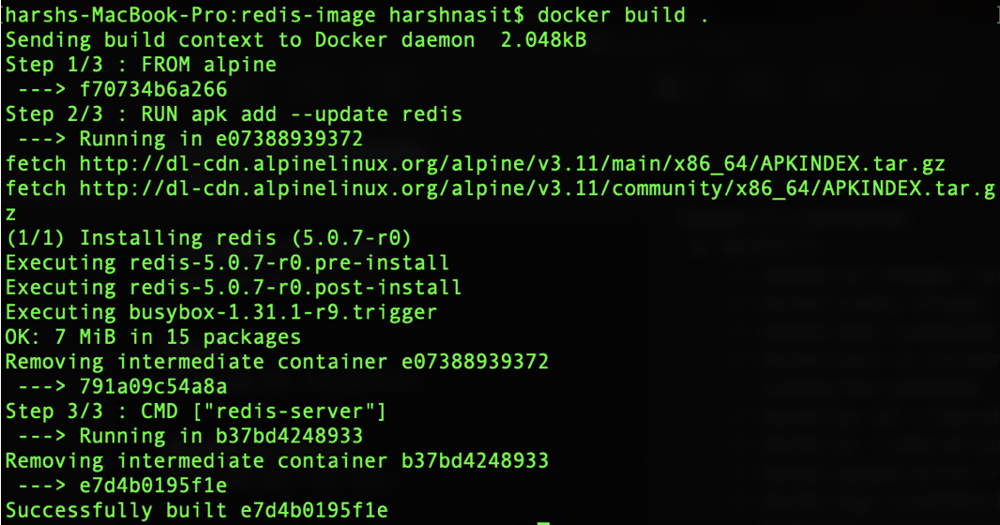
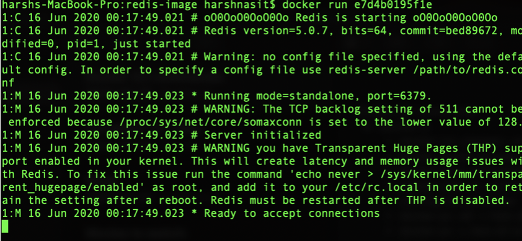

# Docker and Kubernetes: The Complete Guide
## Table of Contents

1. [Creating Docker Images](#CreatingImages)
2. [Building a Docker File](#BuildingDFile)
3. [Docker File Teardown](#FileTeardown)
4. [Whats a Base Image?](#BaseImage)
5. [Build Process in Detail](#BuildProcessDetail)
6. [Rebuilds with Cache](#RebuildCache)
7. [Tagging an image](#Tagging)
8. [Manual image Generation, Docker Commit](#ManualImage)

## Creating Docker Images <a name="CreatingImages"></a>

* Dockerfile will be passed to Docker CLI
* Which is fed to Docker server and creates image
* Flow of creating Dockerfile:
    - Specify base image
    - Run commands to install additional programs
    - Specify command to run on container startup

## Building a Docker file <a name="BuildingDFile"></a>

`docker build .`
This command creates the image by running the Dockerfile in
    the provided directory.

E.g. Creating an image that runs redis server:
```
# Use an existing docker image as a base
FROM alpine
# Download and install a dependency
RUN apk add --update redis
# Tell the image what to do when it starts
# as a container.
CMD ["redis-server"]
```




Since I already have alpine downloaded, it directly accesses the image from the local cache and can be used for creating containers from the alpine image.

Copy the id and execute `docker run <image id>`


 
 ## Docker file teardown <a name="FileTeardown"></a>
 
 Every step represents an instruction for the docker server. The instruction **FROM** is used to specify a base image which contains pre-installed commands/setups. The **RUN** instruction is used to execute some command to setup the pre-requisites. The **CMD** command is used to specify the primary command for the image to be built(or the command that runs when containers are created from this image).
 
## Whats a Base Image <a name="BaseImage"></a>
 
When we create an image, there is no infrastructure and the image is empty. Base Image is used to have an initial setup and further configure dependencies. We used Alpine as a base image because it comes with default set of programs such as apk that can be used to install and run redis. It is necessary to have a base image for using the tools provided by the base image.

## Build process in detail <a name="BuildProcessDetail"></a>

The build command is what we use to take a docker file and generate an image out of it. The **.** is specifying the build context. It is a set of files and folders encapsulated in this container. If the base image is not in the local cache, it downloads it from the docker hub. The flow of image creation is step by step, meaning the temporary image created in 1 step is used in the next step.

E.g. Explanation for the redis-server docker file                                  When the **RUN** step is run, it gets the image from the previous step and creates a new container out of it. Then the apk command is run inside this container modifying the file system by creating a new folder called redis. After that, it takes the file system snapshot and creates a new temporary image by removing the running container.

Next, the **CMD** command takes the previously created temporary image and creates a container out of it. **CMD** sets the primary command for the container which is then saved as a permanent image in the cache. The temporary container gets removed. Now the new image can be used to create and run containers.

## Rebuilds with Cache <a name="RebuildCache"></a>

If the build command is executed again, it uses the cached temporary images to run the similar steps. E.g. If I add another RUN command to install gcc after redis, until step 2 it will use the cached images. Note: if the order of steps is changed, the image will not be built from the cached images, instead it will create new temporary images. This way, using cache helps Docker get speed and performance. To sum up, if a Docker file needs to be changed, always make changes as far down as possible.

## Tagging an image <a name="Tagging"></a>

After building a custom image, it can be tedious to create containers by using the image id. E.g. docker run 94095c54fd6d. Instead images can be tagged with names to make creating of containers readable. Syntax:
`docker build -t <docker_id>/<name of project>:<version> .
`

Version is traditionally going to be latest or a number.
E.g. `docker build -t harshn12/redis:latest .`

Now containers can be created by `docker run harshn12/redis` and by default it runs the latest version. So, the image is being tagged by the version number provided.

## Manual image Generation, Docker Commit <a name="ManualImage"></a>

Generally, containers are created from images, but images can be created from containers manually as well. Syntax: 
`docker commit -c ‘CMD [“redis-server”]’ <container_id>`
This command creates an image out of the provided container id. But this approach is generally avoided.

