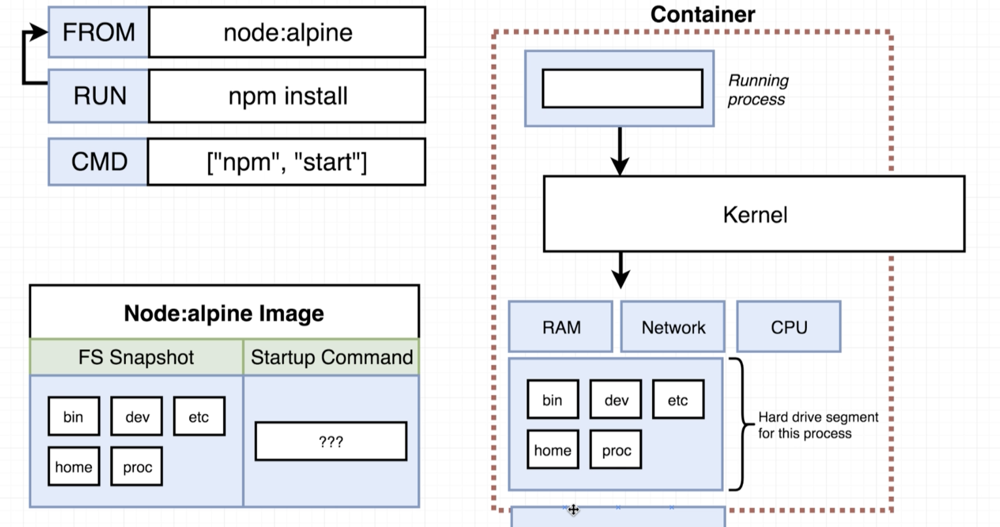
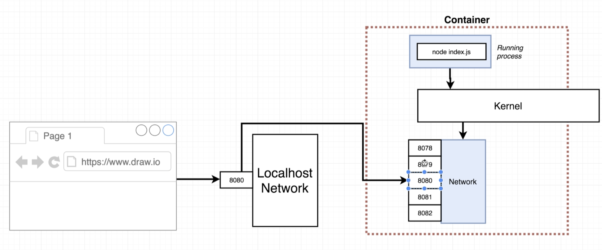
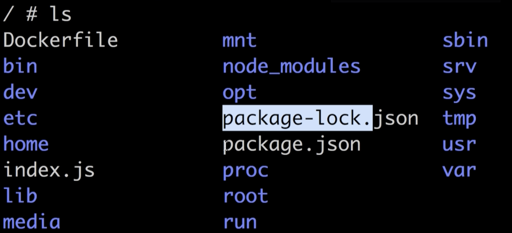
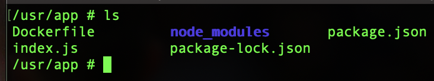

# Docker and Kubernetes: The Complete Guide
## Dockerizing a Simple Web App

## Table of Contents:
1. [Base Image Issues](#BaseImage)
2. [Missing Files](#MissingFiles)
3. [Container Port Mapping](#ContainerMapping)
4. [Specifying Working Directory](#WorkingDirectory)
5. [Unnecessary Builds] (#UnnecessaryBuilds)

## Base Image Issues <a name="BaseImage"></a>

- The commands we use for building and starting the node web app are `npm install` for installing dependencies and `npm start` for starting the node server.
- Alpine as a base image is not useful here because it does not have node and npm installed.
- To get the right base image, go to https://hub.docker.com/ where we find the node image.
- We use the alpine tag for node base image because its small, compact and has the node program we require.
- Now if we try to build the image, it gives an error because the files for node setup are not in the container.

```
# Specify a base image
FROM node:alpine

# Install some dependencies
RUN npm install

# Default command
CMD ["npm", "start"]
```

## Missing Files <a name="MissingFiles"></a>

- When npm install command was run, it tried to find package.json, but the file was not found.
- In the below image, we see that there is no package.json file in the hard drive segment inside the container and so npm install command cannot find it.

- The node files are stored on our local machine outside the container by default. (Segmented off)
- We need to make sure that index.js and package.json files are available inside the container when npm install is run.
- `COPY ./ ./` We use this command to copy the files from the first specified path (Path to folder on local file system) to ./ which is inside the container.
- Path to folder to copy from is relative to build context.
- We ensure that package.json is available before npm install is called so remember ORDER OF COMMANDS MATTERS.

```
# Specify a base image
FROM node:alpine

# Install some dependencies
COPY ./ ./
RUN npm install

# Default command
CMD ["npm", "start"]
```
- Now we can build the image by running `docker build -t <docker_id>/simpleweb .`.
- Now we can create containers of the image, but when we do create a container and open http://localhost:8080/ in the browser, it does not display what we want.

## Container Port Mapping <a name="ContainerMapping"></a>

- The container has it own set of isolated ports just like the localhost network.
- By default no incoming traffic to your machine will be directed to that container.
- We need to setup a port mapping => anytime a request is made to your local network, take that request and map it to a port in the container.
- This port mapping is only for incoming requests, by default the container can make outgoing requests, e.g. base image and installing dependencies.


- To have this port mapping, we start the container by following the below syntax:
`docker run -p localhost_port_num:container_port_num <image name/id>`
e.g. `docker run -p 8080:8080 <docker_id>/simpleweb`
The first port is the local machine port and the 2nd port is the containe port number.
- The ports do not have to be identical. If you change the port in index.js, you need to build the image again.

## Specifying Working Directory <a name="WorkingDirectory"></a>

- When we start shell inside a container by running `docker run -it <docker_id>/simpleweb sh` and check the files, we notice  the node files are copied into the root folder. This does not seem to be the best practise.


- Instead, we specify a working directory where the files will be copied in the container. The command is:
`WORKDIR /usr/app`
Any command following this will be executed relative to this path in the container. So the COPY command will copy files to the specified path using WORKDIR directly.


## Unnecessary Builds <a name="UnnecessaryBuilds"></a>

- Everytime we make changes to the node files or code in general, we need to rebuild the image.
- But it does no make sense to run all the commands every time there is a change. e.g. We do not need to run npm install for the changes made in index.js.
- To prevent this, we add another COPY command before npm install which only runs the npm install command when there are any changes in package.json.
```
# Specify a base image
FROM node:alpine

#Creates a specific folder inside container where the files would be copied.
WORKDIR /usr/app

# Install some dependencies
COPY ./package.json ./
RUN npm install
COPY ./ ./

# Default command
CMD ["npm", "start"]
```
- The above strategy helps to speed time constraints. So now if there are any changes to our code, it does not need to run npm install. Once again, **ORDER OF COMMANDS MATTERS** in terms of **TIME** as well.
