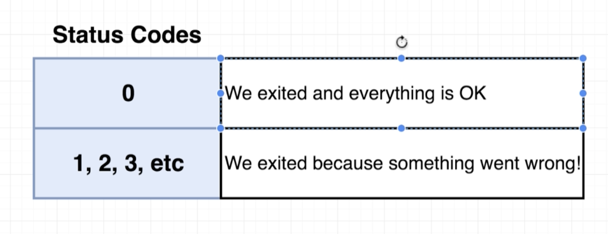
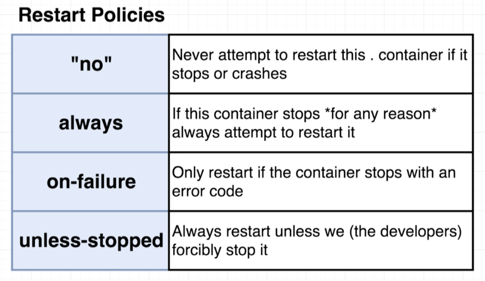
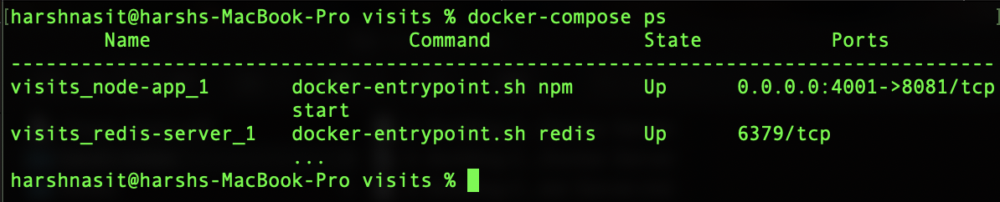

# Docker and Kubernetes: The Complete Guide
## Docker Compose with Multiple Local Containers

## Table of Contents:
1. [Visits Web App](#VisitsWebApp)
2. [Introduction to Docker Compose](#IntroDockerCompose)
3. [Docker Compose Files](#DockerComposeFiles)
4. [Networking with Docker Compose](#NetworkingDockerCompose)
5. [Docker Compose Commands](#DockerComposeCommands)
6. [Container Maintenance with Compose](#DockerComposeMaintenance)

## Visits Web App <a name="VisitsWebApp"></a>

This is a simple web application that displays the number of visits to this website. This is created using the Redis container as well as the container built from the docker file under visits/. We could use redis in the same container as the node app but in this case, every time a new container is created, the redis memory will be independent and we want a single shared memory allocation. Instead, we want multiple node app containers and a single container of the redis image.


## Introduction to Docker Compose <a name="IntroDockerCompose"></a>

When multiple containers are run in parallel, they do not have any automatic communication between them. In order to have communication between separate contianers, we need a network infrastructure. There are 2 options for this:
1. Use Docker CLI's Network features
2. Use Docker Compose

But the issue with Docker CLI is that the CLI commands will have to be run every single time the containers are started manually.
Instead, we will use Docker-compose to start up multiple containers at the same time. It automates some of the long-winded arguements we were passing to docker run.
The biggest advantage of using Docker Compose is to avoid writing the Docker CLI commands to start up a container.

## Docker Compose Files <a name="DockerComposeFiles"></a>

- Essentially, we encoding the Docker CLI commands into the docker-compose.yml file.
`docker build -t <docker id>/visits:latest` and `docker run -p 8080:8080 <docker id>/visits` will be encoded into docker compose file. This file will then be passed to Docker CLI to create those specific containers.
- The hierarchy in docker-compose.yml will be as the below image. In total we create 2 separate containers where the redis image is pulled from docker hub and the node container is from the docker file we built.


- Version on line 1 specifies the docker-compose version. Services basically tells about the containers that will be created. To get a container built from a dockerfile, we use `build: .` like on line 6. We use "-" in yml file to specify an array(Array of ports here).
```
# docker-compose.yml file
version: '3'
services:
  redis-server:
    image: 'redis'
  node-app:
    restart: always
    build: .
    ports:
      - "4001:8081"

```

## Networking with Docker Compose <a name="NetworkingDockerCompose"></a>

- By just defining the services, a network infrastructure is setup by default between the 2 containers. They can communicate on the same network with each other.
- But `- "4001:8081"` is to map local machine to the node app container.
- Now to specify where the redis server is running inside the index.js file, we specify the host as redis-server.
```
const client = redis.createClient({
  host: 'redis-server',
  port: 6379
});
```
- The above line connects to the redis-server container that is running on the same network as the node-app because of docker-compose.

## Docker Compose Commands <a name="DockerComposeCommands"></a>

- To create instances of all the containers or services listed inside the compose file, the following command is executed: `docker-compose up`. This command is very similar to what `docker run myimage` does. The former command automatically looks for the compose file.
- Now if we want to rebuild all the containers inside the compose file, the command is: `docker-compose up --build`. This command rebuilds the containers and starts them up.
- So for instance anytime we have a database driver for a web application, we can create a separate container for it and connect to the host in the web app code.
- Now if we want to stop all the containers running in the compose file, it would be a pain to stop all the containers individually. The command `docker-compose down` is used to close all the running containers specified in the compose file.
- The docker-compose commands have a one-to-one translation from the docker CLI commands.

## Container Maintenance with Compose <a name="DockerComposeMaintenance"></a>

- Sometimes when an error is thrown inside a container, the container is shutdown and it does not restart automatically.
- Now suppose for instance we add `const process = require('process');` on line 3 and replace the lines 12-17 with the below code in index.js file under visits/.
```
app.get('/', (req, res) => {
  process.exit(0)
  client.get('visits', (err, visits) => {
    res.send('Number of visits is ' + visits);
    client.set('visits', parseInt(visits) + 1);
  })
})
```
This will cause the node app container to exit with a status 0 everytime the container is started and we open the root route (http://localhost:4001/) on a browser. The container has basically crashed.
- The status code is used to inform us the reason for stopping the program or container is this case. The status code helps docker decide if the container should be restarted.


- So we specify restart policies inside the compose file to restart the container based on the exit status. There are 4 restart policies as below:


    - By default the "no" restart policy is assigned to    all of the container. The policy states that if the given container crashes, do not attempt to restart the container.
    - The always restart policy is if the container stops for any given reason, automatically restart the container.
    E.g. This is how the node-app container specifies the restart policy:
    ```
    node-app:
    restart: always
    build: .
    ports:
      - "4001:8081"
    ```
    Now if the visits web app crashes because we exit with the status 0, it will automatically restart the container.
    - The on-failure restart policy is only going to restart the container if we get a status code which is not 0(1,2,3, etc.).
    - The "no" restart policy has quotes around it because in a yml file no is a keyword and is interpreted as false.
    - Now we use always restart policy when we always want the container to be running, e.g. a web application server.
    - On the other hand if you are running some worker process whose whole purpose is to finish the work and exit, that might be a good instance for on-failure restart policy.
- Just like the command `docker ps` on docker CLI, there is a similar command for docker-compose `docker-compose ps`. It shows the status of all the containers running of that compose file.


- `docker-compose ps` will specifically look for docker-compose.yml file in the current directory.
