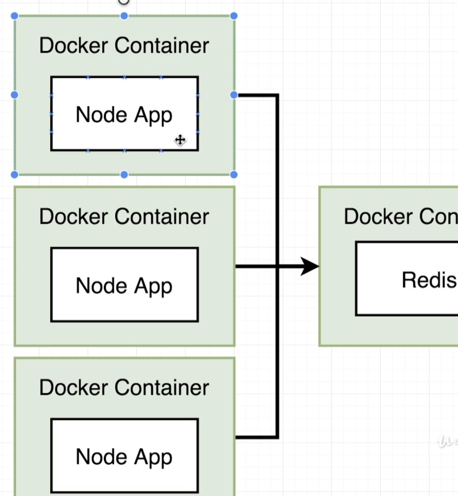
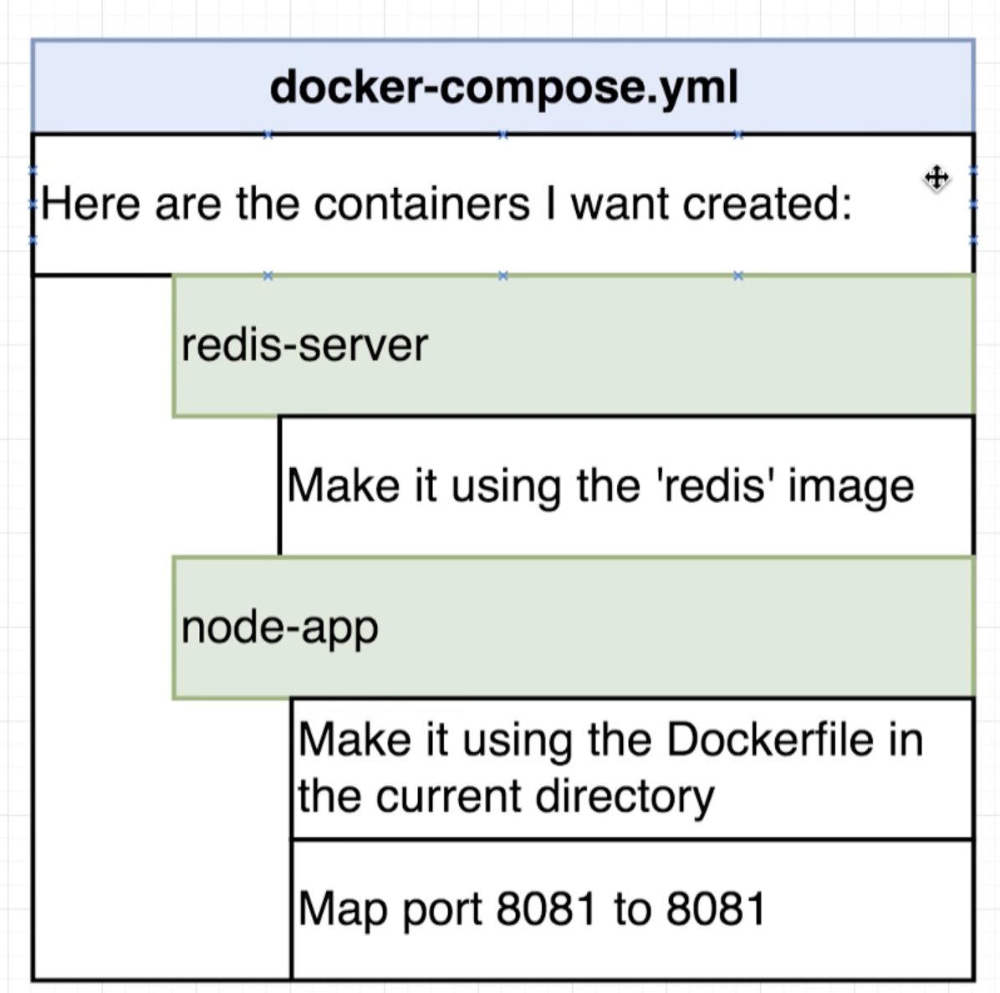

# Docker and Kubernetes: The Complete Guide
## Docker Compose with Multiple Local Containers

## Table of Contents:
1. [Visits Web App](#VisitsWebApp)
2. [Introduction to Docker Compose](#IntroDockerCompose)
3. [Docker Compose Files](#DockerComposeFiles)
4. [Networking with Docker Compose](#NetworkingDockerCompose)
5. [Docker Compose Commands](#DockerComposeCommands)
6. [Container Maintenance with Compose](#DockerComposeMaintenance)
7. [Automatic Container Restarts](#AutomaticContainerRestarts)

## Visits Web App <a name="VisitsWebApp"></a>

This is a simple web application that displays the number of visits to this website. This is created using the Redis container as well as the container built from the docker file under visits/. We could use redis in the same container as the node app but in this case, every time a new container is created, the redis memory will be independent and we want a single shared memory allocation. Instead, we want multiple node app containers and a single container of the redis image.



## Introduction to Docker Compose <a name="IntroDockerCompose"></a>

When multiple containers are run in parallel, they do not have any automatic communication between them. In order to have communication between separate contianers, we need a network infrastructure. There are 2 options for this:
1. Use Docker CLI's Network features
2. Use Docker Compose

But the issue with Docker CLI is that the CLI commands will have to be run every single time the containers are started manually.
Instead, we will use Docker-compose to start up multiple containers at the same time. It automates some of the long-winded arguements we were passing to docker run.
The biggest advantage of using Docker Compose is to avoid writing the Docker CLI commands to start up a container.

## Docker Compose Files <a name="DockerComposeFiles"></a>

- Essentially, we encoding the Docker CLI commands into the docker-compose.yml file.
`docker build -t <docker id>/visits:latest` and `docker run -p 8080:8080 <docker id>/visits` will be encoded into docker compose file. This file will then be passed to Docker CLI to create those specific containers.
- The hierarchy in docker-compose.yml will be as the below image. In total we create 2 separate containers where the redis image is pulled from docker hub and the node container is from the docker file we built.


- Version on line 1 specifies the docker-compose version. Services basically tells about the containers that will be created. To get a container built from a dockerfile, we use `build: .` like on line 6. We use "-" in yml file to specify an array(Array of ports here).
```
# docker-compose.yml file
version: '3'
services:
  redis-server:
    image: 'redis'
  node-app:
    restart: always
    build: .
    ports:
      - "4001:8081"

```

## Networking with Docker Compose <a name="NetworkingDockerCompose"></a>

- By just defining the services, a network infrastructure is setup by default between the 2 containers. They can communicate on the same network with each other.
- But `- "4001:8081"` is to map local machine to the node app container.
- Now to specify where the redis server is running inside the index.js file, we specify the host as redis-server.
```
const client = redis.createClient({
  host: 'redis-server',
  port: 6379
});
```
- The above line connects to the redis-server container that is running on the same network as the node-app because of docker-compose.
