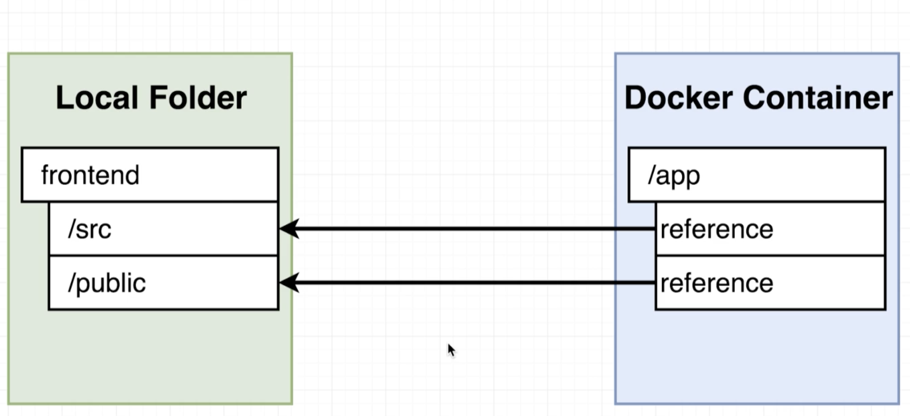
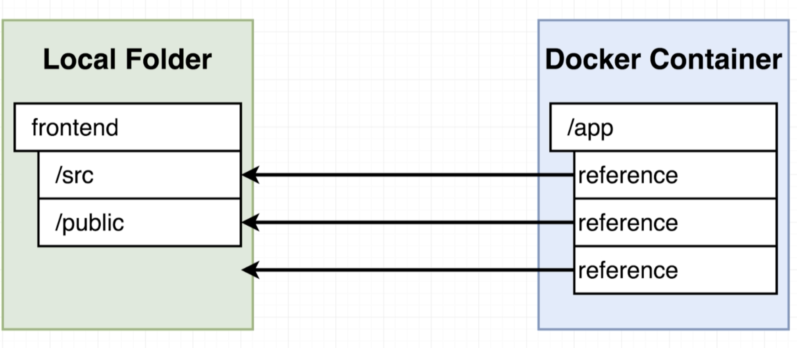
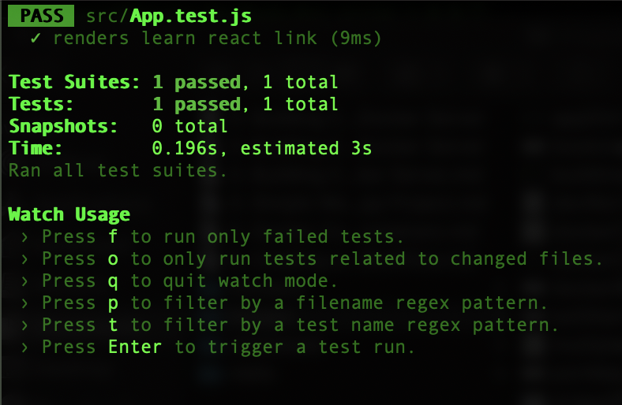
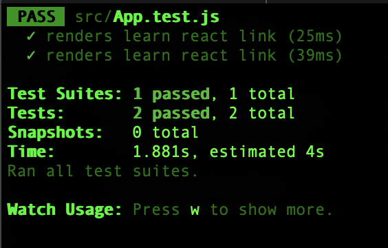

# Docker and Kubernetes: The Complete Guide
## Creating a Production-Grade Workflow

## Table of Contents:
1. [Development Workflow](#DevelopmentWorkflow)
2. [Flow Specifics](#FlowSpecifics)
3. [Docker Volumes](#DockerVolumes)
4. [Bookmarking Volumes](#BookmarkingVolumes)
5. [Volumes in Docker Compose](#VolumesDockerCompose)
6. [Running Tests](#RunningTests)

## Development Workflow <a name="DevelopmentWorkflow"></a>

- Development workflow is essentially divided into 3 parts **development**, **testing** and **deployment**.
- Building a software involves the above 3 processes which are then looped back to **development** creating a repeating cycle. This is because not every software built once is perfect.
- Instead we deploy an app, do some additional development and redeploy the app.


## Flow Specifics <a name="FlowSpecifics"></a>

- Essentially, the way we setup the development workflow on github is using a CI/CD platform e.g. TravisCI or CircleCI.
- An example of how a flow could be setup:
    - **Development**
        - Create a repository on github and branch off to work on a feature.
        - Make changes and push them to the child repository.
        - Once the feature is completed, create a pull request to merge the feature with the master branch.
    - **Testing**
        - After the pull request is approved, the code is pushed to TravisCI to run automated tests. The changes get merged only if all the tests pass.
    - **Deployment**
        - After the feature branch is merged to master, the code is pushed to TravisCI and the tests are run again.
        - Once the tests pass, the code is deployed to AWS Elastic Beanstalk.
- Docker is a tool that will make execution of some of these tasks easier.
- We can make 2 seperate docker files for development and production.
- The development docker file is named **Dockerfile.dev** and the production file is the standard **Dockerfile**.
- To run docker build on a custom filename, we use the command: `docker build -f <filename> .` -f specifies the filename, e.g. `docker build -f Dockerfile.dev .`
- Generally when a react frontend is dockeried and a container is created, the node_modules is created inside the container and so make sure to not have node_modules outside the container which will just be duplicate.

## Docker Volumes <a name="DockerVolumes"></a>

- When we run a container and want to edit the source code, we would have to rebuild the image and run a new container to reflect the new changes, to avoid this and get parallel changes, we use Docker Volumes.
- When the **COPY** command copies the source code, it takes a snapshot of the current code into the docker container and this is static that does not reflect new changes.
- Instead, with docker volumes we essentially set a placeholder in the docker container. This placeholder is like a reference point(similar to reference pointers in C or an element of a list - mutable).


- The command to setup a docker volume is little complex:
`docker run -p 3000:3000 -v /app/node_modules -v $(pwd):/app <image_id>`
    - `-v $(pwd):/app` essentially maps the pwd to the /app folder running inside the container.
    - `-v /app/node_modules` puts a bookmark on the node_modules folder.

## Bookmarking Volumes <a name="BookmarkingVolumes"></a>

- `-v $(pwd):/app` means that we are setting up a reference for all the files on the local folder to the docker container. The issue is that the node_modules folder is only created inside the docker container and has no folder to reference on the local folder because node_modules is created when npm install is run.
- An easy fix to this is by passing the flag `-v /app/node_modules` which does not include `:` and so no reference is created for this folder. There is a colon for the other folders in the local folder.


## Volumes in Docker Compose <a name="VolumesDockerCompose"></a>

- The downside of using volumes with Docker CLI is the long commands used for execution, which is where docker-compose makes it much easier.
- An example of docker-compose file with volumes:
    ```
    version: '3'
        services:
          web:
            build: .
            ports:
              - "3000:3000"
            volumes:
              - /app/node_modules
              - .:/app
    ```
    - Since we are using a custom name docker filename, i.e. Docker.dev file, we add 2 additional options: context and dockerfile.
        -  Context specifies the where do we want the files and folders for the image to be pulled from.
        -  Dockerfile specifies the file which will be built.
    - An interesting thing to note is that because we have setup the volume reference for the source code, we do not necessarily need the `COPY . .` command in the docker file.
    - But as a precaution, we keep the `COPY` command because this is specific to docker-compose and if in the future we decide to use Docker CLI, we would need the command.

## Running Tests <a name="RunningTests"></a>

- We will run a specific command inside the container by overriding the start command: `docker run <image_id> yarn test`.

- When we run docker run, by default we get a connection to standard out inside the container. But if we want to get the input inside the container, we have to hook up to standard in as well. This is done with the `-it` command.
- Since we run `docker build ` and `docker run` to run the test container, we don't have the volumes setup and so even after adding new tests, the container will not reflect the new changes made.
- A solution to this is by attaching the command to run the tests inside the first service.
    - First start up the docker-compose by running `docker-compose up` and then run `docker ps` and get the container id.
    - Then, run the command `docker exec -it <container_id> yarn test` to run the tests inside the initial container.
    
    - We can see above that it automatically detected the new test case and reran the 2 tests.
    - However, this is not the best solution as it involves some manual work which is what we want to avoid.
- A solution to this issue is to setup another service inside the docker-compose file and assign some volumes. The entire purpose of this service would be to run tests.
    - So we add a new service as below:
        ```
        version: '3'
        services:
          web:
            stdin_open: true
            build:
              context: .
              dockerfile: Dockerfile.dev
            ports:
              - "3000:3000"
            volumes:
              - /app/node_modules
              - .:/app
          tests:
            stdin_open: true
            build:
              context: .
              dockerfile: Dockerfile.dev
            volumes:
              - /app/node_modules
              - .:/app
            command: ["yarn","test"]
        ```
    - Basically, when `docker-compose up` is run, it starts up 2 container, first one is responsible for hosting our development server and the other container is solely responsible for running the tests.
    - However, there is an issue with this approach as well. The output for the tests run appears on the logging interface of the docker compose. It limits our interation with the 2 running containers.
