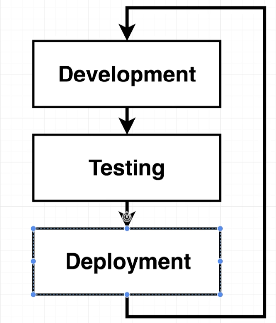

# Docker and Kubernetes: The Complete Guide
## Creating a Production-Grade Workflow

## Table of Contents:
1. [Development Workflow](#DevelopmentWorkflow)
2. [Flow Specifics](#FlowSpecifics)

## Development Workflow 

- Development workflow is essentially divided into 3 parts **development**, **testing** and **deployment**.
- Building a software involves the above 3 processes which are then looped back to **development** creating a repeating cycle. This is because not every software built once is perfect.
- Instead we deploy an app, do some additional development and redeploy the app.

## Flow Specifics 

- Essentially, the way we setup the development workflow on github is using a CI/CD platform e.g. TravisCI or CircleCI.
- An example of how a flow could be setup:
    - **Development**
        - Create a repository on github and branch off to work on a feature.
        - Make changes and push them to the child repository.
        - Once the feature is completed, create a pull request to merge the feature with the master branch.
    - **Testing**
        - After the pull request is approved, the code is pushed to TravisCI to run automated tests. The changes get merged only if all the tests pass.
    - **Deployment**
        - After the feature branch is merged to master, the code is pushed to TravisCI and the tests are run again.
        - Once the tests pass, the code is deployed to AWS Elastic Beanstalk.
- Docker is a tool that will make execution of some of these tasks easier.
