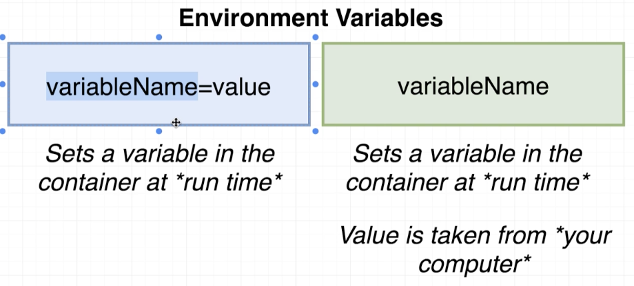
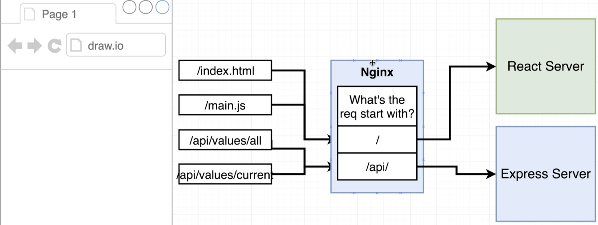
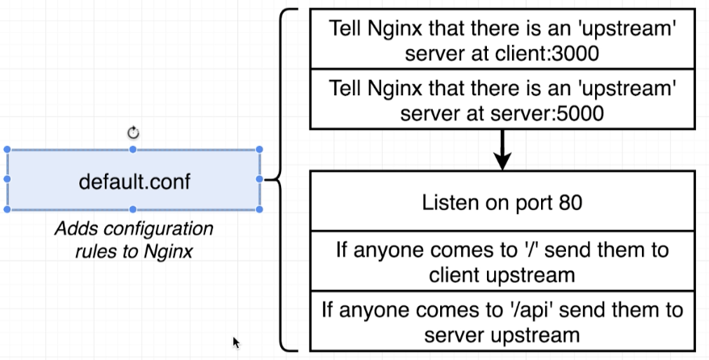

# Docker and Kubernetes: The Complete Guide
## Building a Multi-Container Application

## Table of Contents:
1. [Application Overview](#ApplicationOverview)
2. [Dockerizing the React App](#DockerizingReactApp)
3. [Building the Docker-compose File](#DockerComposeFileReactApp)
4. [Routing with Nginx](#NginxRouting)
5. [Custom Image for Nginx](#CustomImageNginx)
6. [Running the React App](#RunningReactApp)

## Application Overview <a name="ApplicationOverview"></a>

- The application is basically a fibonacci calculator at a particular index which uses multi-container deployment.
- Note, the below architecture is a bit complicated on purpose to explore the multi-container deployment.
- This is what the end application would look like:

- The backend architecture of the application is going to look like the below image. Note, this is just the development architecture, production will be different:

- When the user boots up their browser, they are first going to visit an nginx web server which is essentially going to do some routing.
- The Nginx server is going to decide if the incoming request wants to access the frontend (React Server) or access APIs to fetch data (Express Server).
- Postgres database will be used for storing the values already seen by the user and Redis server will be used to cache the calculated values (temporary values).
- To sum up, when a user clicks on the submit button, the react app is going to make a request to the express server to write the value to the redis and postgres servers.

## Dockerizing the React App <a name="DockerizingReactApp"></a>

- We create **development** Docker files for each one of the below:
    - React App
    - Express Server
    - Worker
- By having 3 separate dev Docker files, we avoid having to rebuild an image when there is a small change in one of the server. Also by using docker-compose, docker files become organized.
- For each of the above server, we will the same pattern of writing the docker file as below:

- The Dockefiles look like below:
```
# Dockefile for React app
FROM node:alpine
WORKDIR '/app'
COPY ./package.json ./
RUN npm install
COPY . .
CMD ["npm","run", "start"]

# Dockerfile for Express Server and Worker
FROM node:alpine
WORKDIR '/app'
COPY ./package.json ./
RUN npm install
COPY . .
CMD ["npm", "run", "dev"]
```
## Building the Docker-compose File <a name="DockerComposeFileReactApp"></a>
- The docker-compose looks like:
```
version: '3'
services:
  postgres:
    image: 'postgres:latest'
    environment:
      - POSTGRES_PASSWORD=postgres_password
  redis:
    image: 'redis:latest'
  nginx:
    depends_on:
      - api
      - client
    restart: always
    build:
      dockerfile: Dockerfile.dev
      context: ./nginx
    ports:
        - '3050:80'
  api:
    build:
      dockerfile: Dockerfile.dev
      context: ./server
    volumes:
      - /app/node_modules
      - ./server:/app
    environment:
      - REDIS_HOST=redis
      - REDIS_PORT=6379
      - PGUSER=postgres
      - PGHOST=postgres
      - PGDATABASE=postgres
      - PGPASSWORD=postgres_password
      - PGPORT=5432
  client:
    stdin_open: true
    build:
      dockerfile: Dockerfile.dev
      context: ./client
    volumes:
      - /app/node_modules
      - ./client:/app
  worker:
    build:
      dockerfile: Dockerfile.dev
      context: ./worker
    volumes:
      - /app/node_modules
      - ./worker:/app

```
- We use **context** to specify the directory where the image **Dockerfile.dev** is present.
- We then specified volumes in a way that puts a hold on node_modules so that it does not override or change it. We then put a reference to the server directory to automatically reflect new changes.
- **ENVIRONMENT VARIABLES WITH DOCKER:**
    - To pass in environment variables to a server, we specify them in a separate section in docker-compose file.
    - Different syntax for specifying environment variables:
    
        - `variableName=value` sets the variable in a container when a container is run.
        - `variableName` sets the variable by getting the value from the local machine on which the container is running.
    - The default redis port is **6379** and the default password for postgres is **postgres_password** and port is **5432** from docker-hub docs.
- Nginx is used in the development environment to route the browser requests to the react and express servers.
- The static files in production (html and js files) are requested from React server and the api calls from the express server which is decided by **NGINX**.
- The NGINX server checks if the request contains `/api`, then it redirects to express server, else react server.

- We don't specify the ports because in production we don't have to juggle between ports since there is a common backend and frontend.

## Routing with Nginx <a name="NginxRouting"></a>
- A file called default.config is created to specify the nginx rules for the requests being made.

- NGINX refers to express and react servers as upstream servers. The server is listening to traffic on port 5000 and the client on port 3000.
- The NGINX server listens on port 80.
- The config file looks like:
```
upstream client {
  server client:3000;
}

upstream api {
  server api:5000;
}

server {
  listen 80;

  location / {
  proxy_pass http://client;
  }

  location /api {
    rewrite /api(.*) /$1 break;
    proxy_pass http://api;
  }
}
```
- We first setup the 2 upstreams and then setup the port that nginx will listen on. `location` redirects requests based on the specified routes to `proxy_pass` (which is the express or react servers).

## Custom Image for Nginx <a name="CustomImageNginx"></a>
- To customize the nginx image, we use the below command from docker-hub docs.
```
FROM nginx
COPY ./default.config /etc/nginx/conf.d/default.conf
```
- /default.config is included by default which we are overwriting.
- We use restart because we want to make sure nginx is always running.

## Running the React App <a name="RunningReactApp"></a>
- To run the react app, run the CLI command `docker-compose up--build`. It might fail some builds initially.
- Once it has compiled successfully, visit http://localhost:3050/ and it should work.
