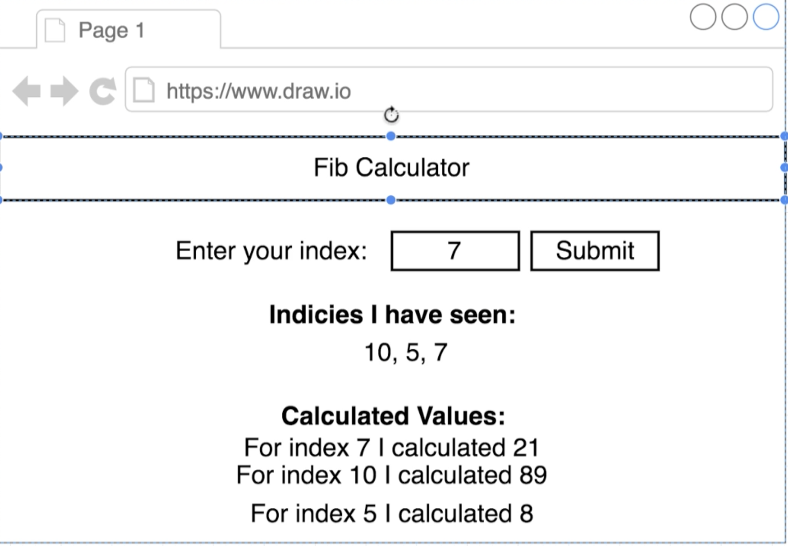
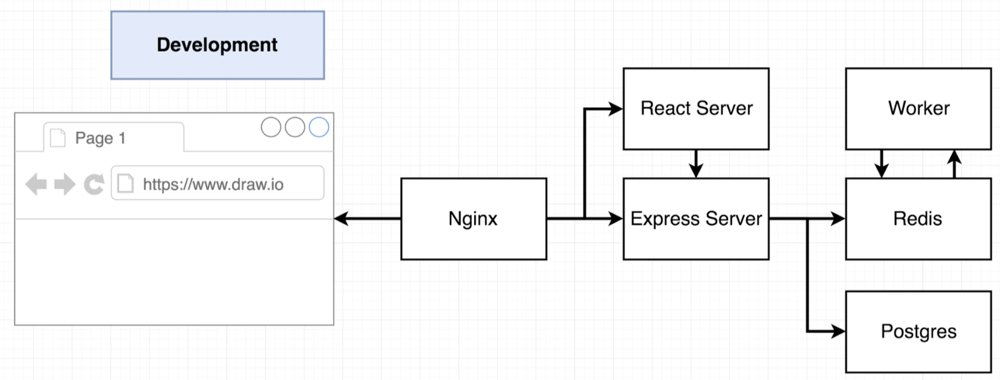
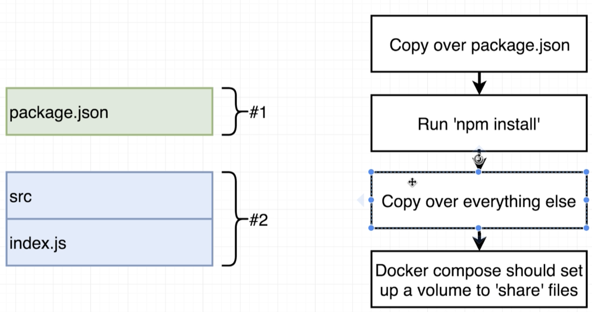

# Docker and Kubernetes: The Complete Guide
## Building a Multi-Container Application

## Table of Contents:
1. [Application Overview](#ApplicationOverview)
2. [Dockerizing the React App](#DockerizingReactApp)

## Application Overview <a name="ApplicationOverview"></a>

- The application is basically a fibonacci calculator at a particular index which uses multi-container deployment.
- Note, the below architecture is a bit complicated on purpose to explore the multi-container deployment.
- This is what the end application would look like:

- The backend architecture of the application is going to look like the below image. Note, this is just the development architecture, production will be different:

- When the user boots up their browser, they are first going to visit an nginx web server which is essentially going to do some routing.
- The Nginx server is going to decide if the incoming request wants to access the frontend (React Server) or access APIs to fetch data (Express Server).
- Postgres database will be used for storing the values already seen by the user and Redis server will be used to cache the calculated values (temporary values).
- To sum up, when a user clicks on the submit button, the react app is going to make a request to the express server to write the value to the redis and postgres servers.

## Dockerizing the React App <a name="DockerizingReactApp"></a>

- We create **development** Docker files for each one of the below:
    - React App
    - Express Server
    - Worker
- By having 3 separate dev Docker files, we avoid having to rebuild an image when there is a small change in one of the server.
- For each of the above server, we will the same pattern of writing the docker file as below:

- The Dockefiles look like below:
```
# Dockefile for React app
FROM node:alpine
WORKDIR '/app'
COPY ./package.json ./
RUN npm install
COPY . .
CMD ["npm","run", "start"]

# Dockerfile for Express Server and Worker
FROM node:alpine
WORKDIR '/app'
COPY ./package.json ./
RUN npm install
COPY . .
CMD ["npm", "run", "dev"]
```
